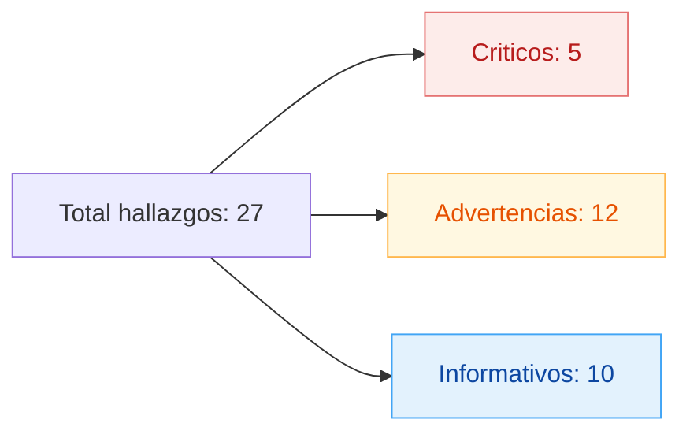
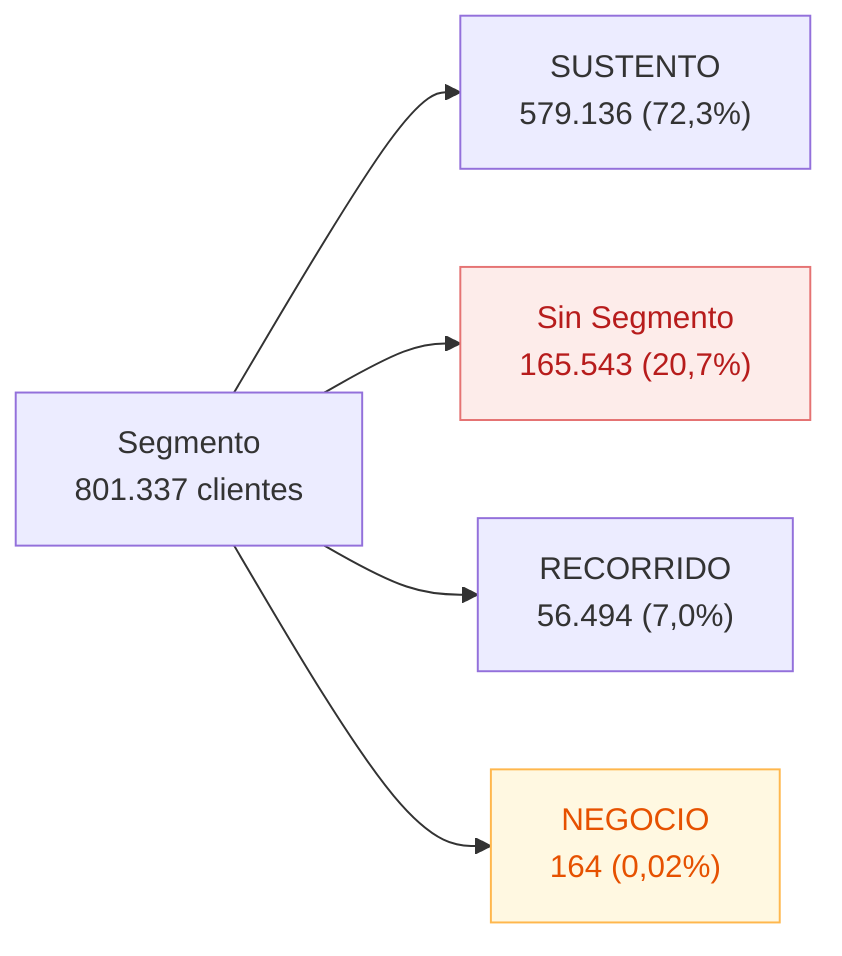
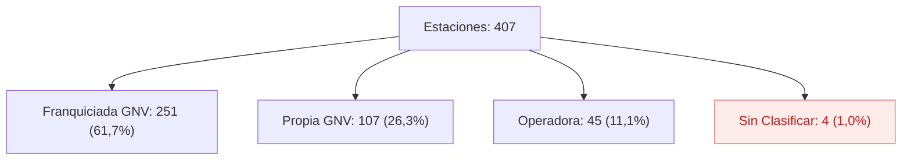
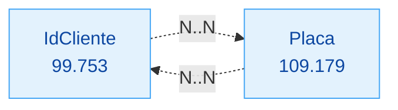
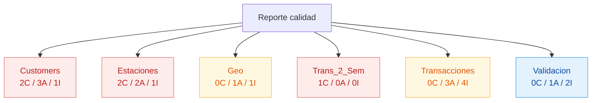
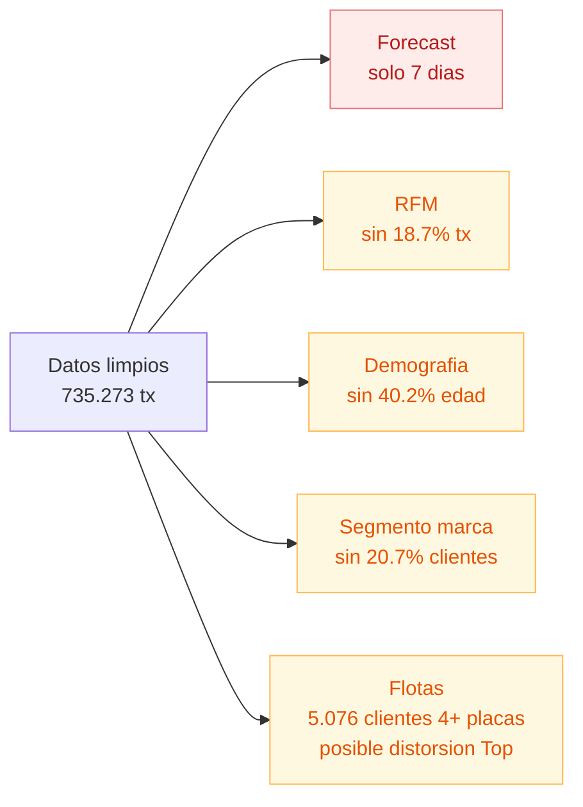

# Hallazgos de calidad de datos — On Daxelta

> Revisión del `output/reporte_inconsistencias.txt` con validación contra fuente y visualización.
> Fuente: `Customers.xlsx`, `Estaciones`, `Geo.xlsx`, `Trans_Sem`, `Trans_2_Sem`.

## 1. Resumen ejecutivo

| Severidad | Cantidad | Acción esperada |
|-----------|----------|-----------------|
| Crítico | 5 | Bloquear hasta corregir en fuente |
| Advertencia | 12 | Documentar y compensar en limpieza |
| Informativo | 10 | Registrar para trazabilidad |



### Cifras finales tras limpieza (sin pérdida de data)

| Entidad | Registros | Eliminados | Marcados |
|---------|-----------|------------|----------|
| Geo | 1.126 | 0 | 4 internacionales (flag `EsInternacional`) |
| Estaciones | 407 | 1 (IdEstacion=0 basura: sin tipo, sin ciudad) | 4 sin clasificar |
| Customers | 801.337 | 0 | 322.412 (40,2%) FechaNac no confiable · 165.543 (20,7%) sin segmento real |
| Transacciones | 735.273 | 4.408 (4.406 duplicados exactos + 2 Gal≤0) | 137.383 sin cliente · 7.353 outliers |

**Política de eliminación:** solo se eliminan registros que (a) son basura técnica sin posibilidad de relación (IdEstacion=0 con IdCiudad=0 y TipoEstacion=NaN) o (b) son duplicados exactos / valores numéricos imposibles (Gal≤0). Todo lo demás se marca con flags para análisis selectivo en Power BI.

---

## 2. Hallazgos por archivo

### 2.1 Customers

| # | Severidad | Hallazgo | Cantidad |
|---|-----------|----------|----------|
| 1 | CRÍTICO | FechaNacimiento nula | 19.708 |
| 2 | CRÍTICO | Nacidos después de 2017 (imposible) | 89 |
| 3 | ADVERT | Edad < 16 años (no titulares) | 114.774 |
| 4 | ADVERT | Edad > 90 años | 187.930 |
| 5 | ADVERT | Segmento NaN (nulo técnico) | 1 |
| 6 | ADVERT | Segmento `"Sin Segmento"` literal en fuente | 165.542 |
| 7 | INFO | FechaNac NO confiable (marcada) | 322.412 (40,2%) |

**Distribución actual de Segmento (tras limpieza):**



### 2.2 Estaciones

| # | Severidad | Hallazgo | Cantidad |
|---|-----------|----------|----------|
| 1 | CRÍTICO | IdEstacion = 0 (fila inválida) | 1 |
| 2 | CRÍTICO | TipoEstacion nulo | 5 |
| 3 | ADVERT | Variantes sucias TipoEstacion (8 antes de normalizar) | — |
| 4 | ADVERT | Sin clasificar tras normalizar | 4 |

**Distribución final TipoEstacion:**



**Variantes detectadas antes de normalizar:**

- `Propia GNV` ✓
- `Operadora` ✓
- `Franquiciada GNV` ✓
- `Franquiciada  Banderazo GNV` → mapeado a Franquiciada GNV
- `anquiciada GNV` → typo, mapeado a Franquiciada GNV
- ` Operadora                    ` → strip
- `Franquiciada GNV \r\r\n` → strip + control chars
- ` Franquiciada GNV             ` → strip

### 2.3 Geo

| # | Severidad | Hallazgo | Cantidad |
|---|-----------|----------|----------|
| 1 | ADVERT | IdCiudad < 0 (México, Chile, Perú, Venezuela) — marcadas con flag, no eliminadas | 4 |
| 2 | INFO | IdCiudad = 0 (`NO DEFINIDA (COLOMBIA)`) — bandera para clientes sin geo precisa | 1 |
| 3 | INFO | Colombia 1.122 / Internacional 4 / Total 1.126 | — |

**Decisión de diseño:** Geo conserva las 1.126 ciudades. En Power BI se filtran las internacionales con un slicer sobre `EsInternacional`. Evita pérdida de relación con 13.364 clientes asociados a ciudades internacionales.

### 2.4 Trans_2_Sem

| # | Severidad | Hallazgo | Cantidad |
|---|-----------|----------|----------|
| 1 | CRÍTICO | Header desplazado vs contenido | 369.498 filas afectadas |

**Orden incorrecto del header en fuente:**

```
FechaVenta | Placa | IdCliente | IdEstacion | ValorVenta | Gal_Fid | Gal
```

**Orden real del contenido:**

```
Placa | IdCliente | IdEstacion | ValorVenta | Gal_Fid | Gal | FechaVenta
```

### 2.5 Transacciones unificadas

| # | Severidad | Hallazgo | Cantidad |
|---|-----------|----------|----------|
| 1 | INFO | `Trans_Sem` y `Trans_2_Sem` son dos sistemas paralelos sobre la MISMA semana (24-30 jul 2017) | — |
| 2 | INFO | Antes dedup: 739.681 (Sem 370.183 + 2_Sem 369.498) | — |
| 3 | ADVERT | Duplicados exactos eliminados (solapamiento ~1% entre sistemas) | 4.406 |
| 4 | ADVERT | Sin IdCliente (-99999), conservados marcados | 137.383 (18,7%) |
| 5 | ADVERT | Gal ≤ 0 (eliminados) | 2 |
| 6 | INFO | Outliers ValorVenta > $34.392 (marcados) | 7.353 |
| 7 | INFO | Outliers Gal > 22,06 (marcados) | 7.351 |
| 8 | ADVERT | Clientes en tx sin ficha Customers | 2.055 |
| 9 | INFO | Finales | 735.273 |

**Nomenclatura de los archivos fuente — interpretación operativa:**

Los nombres `Trans_Sem` y `Trans_2_Sem` sugieren "semana 1 y semana 2", pero la verificación muestra que **ambos archivos cubren la misma semana** (24-30 jul 2017) sobre las **mismas 279 estaciones**, con transacciones mayoritariamente distintas (98,9% no se repite). Interpretación adoptada: son **dos sistemas/canales paralelos** que registraron la operación de la misma semana de forma independiente, con un pequeño solapamiento (~1%) por sincronización entre sistemas.

| Métrica | Trans_Sem | Trans_2_Sem | Comentario |
|---------|-----------|-------------|------------|
| Filas | 370.183 | 369.498 | Casi idénticas |
| Placas únicas | 105.686 | 105.428 | 84.040 en ambos, ~21k exclusivas cada uno |
| IdCliente únicos | 85.147 | 85.130 | Equilibrados |
| Estaciones | 279 | 279 | **Mismas 279 estaciones** |
| Sin cliente (-99999) | 69.500 | 68.660 | Tasa similar |
| Filas en ambos archivos (clave natural) | 8.462 | (4.231 pares) | Solapamiento ~1% |

**Ventana real del análisis: 7 días** (no 14 como sugiere el nombre). Esto debilita aún más cualquier forecast o análisis de tendencia.

**Sugerencia al negocio:** renombrar los archivos en origen para reflejar su naturaleza real (ej. `Trans_Sistema_A` / `Trans_Sistema_B`) o consolidarlos en una sola fuente con un campo `OrigenSistema`.

### 2.6 Validación cruzada (integridad referencial)

| # | Severidad | Hallazgo | Cantidad |
|---|-----------|----------|----------|
| 1 | INFO | Estaciones en tx sin maestro | 0 ✓ |
| 2 | ADVERT | IdCiudad Customers sin match en Geo (Col+Intl) | 9 |
| 3 | INFO | IdCiudad Estaciones sin match en Geo | 0 ✓ |

> Nota: el conteo bajó de 12 (versión anterior, solo Colombia) a 9 (Geo completo). Las 3 IdCiudad faltantes eran internacionales que ahora sí hacen match.

### 2.7 Cardinalidades del modelo (IdCliente ↔ Placa)

La relación cliente↔placa en `trans_clean.csv` es **muchos-a-muchos**, no 1:1 como sugiere el nombre.

**Cliente → Placas distintas (99.753 clientes identificados):**

| Placas por cliente | Clientes | % | Interpretación |
|--------------------|----------|---|----------------|
| 1 | 81.930 | 82,1% | Particular típico |
| 2 | 10.501 | 10,5% | Particular con 2 vehículos |
| 3 | 2.245 | 2,3% | — |
| 4+ | 5.076 | 5,1% | Flotas / empresas / taxis |

Máximo observado: **27 placas en un solo IdCliente** (`1765245`).

**Placa → Clientes distintos (109.179 placas únicas):**

| Clientes por placa | Placas | % | Interpretación |
|--------------------|--------|---|----------------|
| 1 | 86.167 | 78,9% | Vehículo de un solo cliente |
| 2 | 15.252 | 14,0% | Conductor + dueño |
| 3+ | 7.760 | 7,1% | Rotación (taxi, empresa) o error de captura |



**Implicaciones para los análisis (F1–F6):**

| Análisis | Unidad correcta | Riesgo si se ignora |
|----------|-----------------|---------------------|
| F1 Volumetría día semana | tx | Ninguno (se agrega sobre transacción) |
| F2 Forecast | tx | Ninguno |
| F3 Regional | tx + clientes únicos por dpto | `DISTINCTCOUNT(IdCliente)` correcto |
| F4 Estaciones | tx + clientes únicos por estación | `DISTINCTCOUNT(IdCliente)` correcto |
| F5 RFM | **IdCliente** (NUNCA Placa) | Doble conteo si se usa placa |
| F6 Top clientes | **IdCliente** | Inflar valor si se cuenta por placa |

**Riesgo adicional — flotas:** los clientes con muchas placas (5.076 con 4+) concentran ticket promedio alto. Pueden distorsionar el Top 10/20% si no se segmentan como categoría "Empresa/Flota". Recomendable agregar un flag derivado `EsFlota = NumPlacas >= 4` en DAX:

```dax
NumPlacas := DISTINCTCOUNT( trans_clean[Placa] )
EsFlota   := IF( [NumPlacas] >= 4, "Flota", "Particular" )
```

---

## 3. Inconsistencias detectadas en versión anterior del reporte

### 3.1 Segmento subestimado

La versión anterior reportaba `Segmento nulo → 1`, pero la fuente contiene la categoría literal `"Sin Segmento"` como valor real. El verdadero porcentaje sin clasificar es **20,7%**, no 0,0001%.

**Verificación contra fuente (`Customers.xlsx`):**

| Valor en fuente | Frecuencia |
|-----------------|------------|
| `SUSTENTO` | 576.186 |
| `Sin Segmento` (literal) | 165.528 |
| `RECORRIDO` | 56.213 |
| ` SUSTENTO ` (con espacios) | 2.950 |
| ` RECORRIDO ` (con espacios) | 281 |
| `NEGOCIO` | 164 |
| ` Sin Segmento ` (con espacios) | 14 |
| NaN | 1 |

**Implicación:** el segmento original de la marca solo discrimina al 79,3% de los clientes. Para análisis demográfico/comportamental hay que apoyarse en RFM, no en Segmento.

**Corrección aplicada en `limpieza_ondaxelta.py`:** el log ahora diferencia `Segmento NaN (1)` de `Segmento "Sin Segmento" literal (165.542)` para evitar la subestimación.

### 3.2 Ciudad `NO DEFINIDA (COLOMBIA)` perdida silenciosamente

La versión anterior filtraba Geo con `IdCiudad > 0`, eliminando la fila con `IdCiudad = 0` que corresponde a `"NO DEFINIDA (COLOMBIA)"`. Esta fila es la bandera oficial para clientes/estaciones sin geografía precisa.

**Corrección aplicada:** Geo conserva las 1.126 ciudades originales con flag `EsInternacional`. El registro `IdCiudad=0` queda como Colombia normal.

### 3.3 Pérdida de relación con 13.364 clientes internacionales

La versión anterior separaba las 4 ciudades internacionales en un dataframe aparte que nunca se guardaba. Los 13.364 clientes asociados quedaban huérfanos en cualquier join geográfico.

**Corrección aplicada:** geo_clean.csv conserva las 4 internacionales con `EsInternacional = True`. En Power BI se filtran con slicer.

---

## 4. Mapa de severidad por archivo



---

## 5. Recomendaciones de estandarización

### Origen / sistema fuente

1. **Customers.FechaNacimiento**: validar en captura. Rechazar fechas futuras o `año_actual - año_nac < 16`. Reportar nulos por canal.
2. **Customers.Segmento**: lista controlada con dominio `[SUSTENTO, RECORRIDO, NEGOCIO]`. Eliminar la opción literal `"Sin Segmento"` — debe ser un nulo enrutado a flujo de asignación, no una categoría real.
3. **Trans_2_Sem.header**: corregir orden de columnas en el sistema fuente. El orden correcto es `Placa | IdCliente | IdEstacion | ValorVenta | Gal_Fid | Gal | FechaVenta`.
4. **Estaciones.TipoEstacion**: dominio controlado `[Propia GNV, Franquiciada GNV, Operadora]`. Validar en captura: sin espacios, sin saltos de línea, sin typos. Tratar `Banderazo` como subtipo, no como tipo.
5. **Política internacional**: definir si las 4 ciudades con `IdCiudad < 0` son test, sandbox o operación real. Si son operación, asignar IDs positivos y normalizar bandera país. Hoy quedan conservadas en `geo_clean.csv` con flag `EsInternacional` para filtrado en PBI.

### Programa de captura

6. **IdCliente -99999 (18,7% del valor)**: ~$8M en ventas no atribuidas. Programa de identificación en punto de venta (token, app, QR) para subir cobertura por encima del 90%.
7. **2.055 clientes activos sin ficha en Customers**: revisar latencia de sincronización del maestro o flujo de alta en estación.

### Análisis

8. **Outliers**: auditar manualmente los 7.353 tickets sobre $34.392 y 7.351 transacciones sobre 22 galones. Probablemente carga pesada legítima, pero confirmar con operación.
9. **Edad como dimensión**: usar solo donde `FechaNac_confiable == True` (59,8% de la base). El restante 40,2% no aporta evidencia demográfica.

### Pipeline

10. **Reporte de inconsistencias**: ajustar el log para que detecte categorías literales sin clasificar (caso `Sin Segmento`) y no solo NaN técnicos. Hoy subestima el problema en factor 165.000×.

---

## 6. Riesgos residuales



Cada análisis posterior (F1 a F6) debe declarar explícitamente cuál de estos riesgos afecta sus conclusiones.
