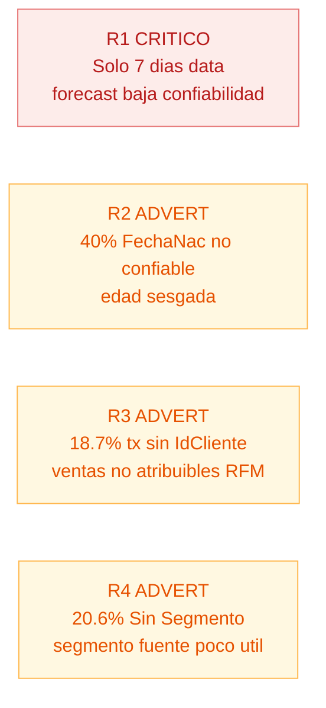

# Plan multifase — Prueba Analista de Datos On Daxelta

> Control sesión a sesión. Todas las fases completadas.

## Contexto

- **Limpieza**: `limpieza_ondaxelta.py` ejecutado. CSVs en `/output/`.
- **Ventana datos**: 7 días (24-30 jul 2017). Trans_Sem y Trans_2_Sem son dos sistemas paralelos sobre la misma semana.
- **Visualización**: Power BI PBIP con DAX. Dos páginas: Dashboard General + Demografía Edades.
- **Entregables**: CSVs limpios + documentos `.md` con hallazgos + dashboard Power BI.

## Arbol EDT

```mermaid
graph TD
    P["Prueba On Daxelta"]
    P --> F0["F0: Hallazgos + Plan"]
    P --> F1["F1: Volumetria dia semana"]
    P --> F2["F2: Forecast Mar/Mie"]
    P --> F3["F3: Regional"]
    P --> F4["F4: Estaciones"]
    P --> F5["F5: Segmentacion RFM"]
    P --> F6["F6: Top clientes"]
    P --> F7["F7: Consolidado entrega"]
    P --> F8["F8: Modelo PBI + DAX"]

    style F0 fill:#E8F5E9,stroke:#66BB6A,color:#1B5E20
    style F1 fill:#E8F5E9,stroke:#66BB6A,color:#1B5E20
    style F2 fill:#E8F5E9,stroke:#66BB6A,color:#1B5E20
    style F3 fill:#E8F5E9,stroke:#66BB6A,color:#1B5E20
    style F4 fill:#E8F5E9,stroke:#66BB6A,color:#1B5E20
    style F5 fill:#E8F5E9,stroke:#66BB6A,color:#1B5E20
    style F6 fill:#E8F5E9,stroke:#66BB6A,color:#1B5E20
    style F7 fill:#E8F5E9,stroke:#66BB6A,color:#1B5E20
    style F8 fill:#E8F5E9,stroke:#66BB6A,color:#1B5E20
```

## Checklist por fase

### F0 — Hallazgos + Plan
- [x] Verificar consistencia `reporte_inconsistencias.txt`
- [x] Detectar inconsistencia Segmento (1 NaN vs 165k "Sin Segmento" real)
- [x] Crear `PLAN.md`
- [x] Crear `HALLAZGOS.md` (revisión reporte + Mermaid)
- [x] Refactor `limpieza_ondaxelta.py`
- [x] Re-ejecutar limpieza, validar cifras

### F1 — Volumetria dia semana
- [x] Cifras `vol_dia` validadas
- [x] DAX: Total Gal, Pct Gal por dia, ranking dia, brecha pico/valle
- [x] `hallazgos/01_volumetria.md`

### F2 — Forecast Mar/Mie
- [x] Método: naive estacional + banda CV
- [x] Fechas validadas: 2017-08-01 (mar), 2017-08-02 (mie)
- [x] DAX: medida pronóstico + banda min/max + CV
- [x] `hallazgos/02_forecast.md`

### F3 — Regional
- [x] Top 15 dptos por ValorVenta (19 con operación)
- [x] Pareto: 7 dptos = 80%, 2 dptos = 50%
- [x] DAX: Pct Valor Dpto, Ranking Dpto, Pct Acumulado, Top 7 flag
- [x] `hallazgos/03_regional.md`

### F4 — Estaciones
- [x] Por TipoEstacion + cobertura maestro
- [x] Pareto: 166 estaciones = 80%
- [x] DAX: Pct Fidelización, Ranking Estación, Cobertura maestro
- [x] `hallazgos/04_estaciones.md`

### F5 — Segmentacion RFM
- [x] 10 segmentos cualitativos + caracterización edad, segmento original, geo, flotas
- [x] DAX: R/F/M Score, Segmento RFM, EsFlota
- [x] `hallazgos/05_rfm.md`

### F6 — Top clientes
- [x] Concentración top 1/5/10/20/30/50%
- [x] Pareto inverso: 80% valor = 51.2% clientes
- [x] DAX: Ranking Cliente, Pct Valor Acumulado, Es Top 1 Pct
- [x] `hallazgos/06_top_clientes.md`

### F7 — Documentacion final
- [x] `PROCESO.md`
- [x] `RECOMENDACIONES.md`
- [x] `README.md`
- [x] Verificar entregables finales

### F8 — Modelo semantico PBI + DAX
- [x] Proyecto PBIP: `VisualP.pbip` + `.SemanticModel` + `.Report`
- [x] 7 tablas (4 CSV + Calendario + Forecast + _Medidas)
- [x] 5 relaciones corregidas (errores de cardinalidad y referencia cíclica resueltos)
- [x] 10 columnas calculadas RFM en `Clientes`
- [x] 53 medidas DAX en `_Medidas` con carpetas de visualización
- [x] Dashboard General: 6 KPIs + combo chart + 2 donuts + barra + tabla
- [x] Página Demografía - Edades: 3 KPIs + 2 barras + donut + tabla
- [x] Corrección Edad como entero en CSV (fix locale es-CO)
- [x] Medidas de edad autocontenidas (calculan desde FechaNacimiento, no dependen del CSV)
- [x] Optimización `limpieza_ondaxelta.py`: fastexcel + pyarrow + engine C para CSVs
- [x] Abrir en Power BI Desktop + Actualizar ✓

## Errores corregidos en el modelo

| Error | Causa | Fix |
|---|---|---|
| Edad corrupta como texto | `dataType: string` en TMDL + override manual | Cambiado a `double`, Power Query a `type number` |
| Referencia cíclica en Geo | Relación con `bothDirections` + cardinalidad invertida | Removido `crossFilteringBehavior`, marcada inactiva |
| Duplicado IdCiudad en Estaciones | `fromCardinality: one` en relación inactiva | Removida propiedad de cardinalidad |
| Duplicado IdCliente en Clientes | Script nunca deduplicaba customers | `Table.Distinct` en PQ + `drop_duplicates` en Python |
| Edades > 100 en visuals | `summarizeBy: sum` + float `45.0` leído como `450` en locale es-CO | `summarizeBy: none` + `Edad` como `Int64` en CSV |

## Riesgos documentados

