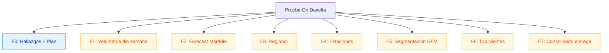
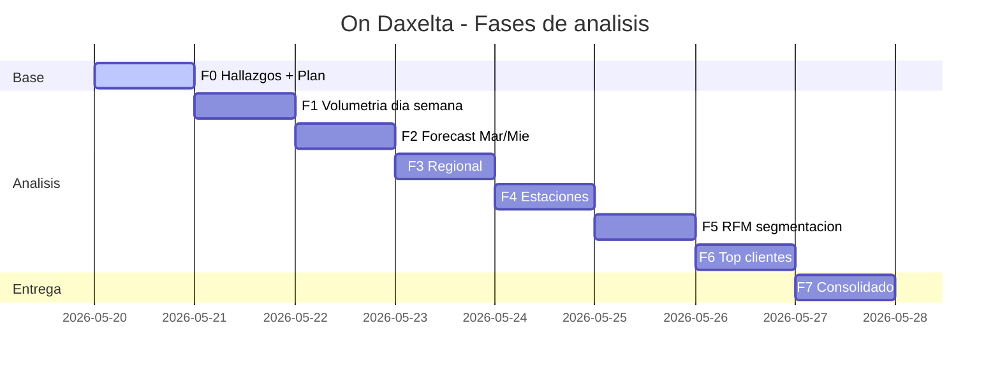
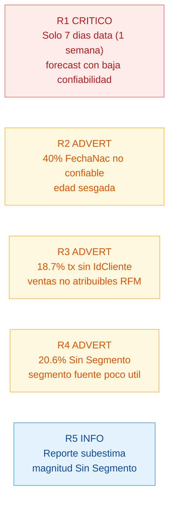

# Plan multifase — Prueba Analista de Datos On Daxelta

> Control sesion a sesion. Marcar checklist al avanzar. Cada fase = una sesion.

## Contexto

- **Limpieza**: `limpieza_ondaxelta.py` ejecutado. CSVs en `/output/`.
- **Analisis orientativo**: `analisis_ondaxelta.py` (solo consola, sin Excel).
- **Visualizacion**: Power BI manual con DAX. Yo doy orientacion + medidas DAX por punto.
- **Entregables**: CSVs + documentos `.md` con hallazgos + Mermaid.
- **Ventana datos**: 7 dias (24-30 jul 2017). Trans_Sem y Trans_2_Sem son dos sistemas paralelos sobre la misma semana, no semanas distintas.

## Preguntas sin resolver

- ¿Fechas exactas min/max FechaVenta?
- ¿Año referencia 2017 (limpieza) confirmado?
- ¿DAX en español o ingles?
- ¿Modelo PBI ya creado o lo armamos?
- ¿Tabla calendario en PBI lista?

## Arbol EDT



## Cronograma



## Checklist por fase

### F0 — Hallazgos + Plan (sesion actual)
- [x] Verificar consistencia `reporte_inconsistencias.txt`
- [x] Detectar inconsistencia Segmento (1 NaN vs 165k "Sin Segmento" real)
- [x] Eliminar exportacion Excel innecesaria
- [x] Crear `PLAN.md`
- [x] Crear `HALLAZGOS.md` (revision reporte + Mermaid)
- [x] Refactor `limpieza_ondaxelta.py` (Geo con flag, Segmento diferenciado, sin perdida data)
- [x] Re-ejecutar limpieza, validar cifras
- [x] Eliminar `analisis_ondaxelta.py` (generaba resultados, no sirve)
- [x] Actualizar `HALLAZGOS.md` con cifras nuevas
- [x] Documentar cardinalidades IdCliente <-> Placa (N..N, flotas)
- [ ] Validar con usuario

### F1 — Volumetria dia semana
- [x] Cifras `vol_dia` validadas (ventana real: 7 dias)
- [x] Mermaid barras dia + tabla
- [x] DAX: Total Gal, Pct Gal por dia, ranking dia, brecha pico/valle
- [x] `hallazgos/01_volumetria.md`

### F2 — Forecast Mar/Mie
- [x] Metodo: naive estacional + media*factor (equivalentes con 7 dias)
- [x] Fechas validadas: 2017-08-01 (mar), 2017-08-02 (mie)
- [x] DAX: medida pronostico + banda min/max + CV
- [x] Limitacion documentada: 7 dias historicos, banda CV inter-dia
- [x] `hallazgos/02_forecast.md`

### F3 — Regional
- [x] Top 15 dptos por ValorVenta (19 con operacion)
- [x] Pareto: 7 dptos = 80%, 2 dptos = 50%
- [x] Detalle top 10 ciudades
- [x] DAX: Pct Valor Dpto, Ranking Dpto, Pct Acumulado, Top 7 flag
- [x] `hallazgos/03_regional.md`

### F4 — Estaciones
- [x] Por TipoEstacion + cobertura maestro (51% Propias inactivas)
- [x] Pareto: 166 estaciones = 80%
- [x] Top 10 + bottom/top fidelizacion
- [x] DAX: Pct Fidelizacion, Ranking Estacion, Pct Acumulado, Cobertura maestro
- [x] `hallazgos/04_estaciones.md`

### F5 — Segmentacion RFM
- [x] R con scoring manual (7 dias) + F, M quintiles balanceados
- [x] 10 segmentos cualitativos + caracterizacion edad, segmento original, geo, flotas
- [x] DAX: R/F/M Score, Segmento RFM, EsFlota, metricas por segmento
- [x] `hallazgos/05_rfm.md`

### F6 — Top clientes
- [x] Concentracion top 1/5/10/20/30/50%
- [x] Pareto inverso: 80% valor = 51,2% clientes (regla 80/50 no 80/20)
- [x] Top 10 individuales + perfiles Top 10% y Top 1% (63% flotas)
- [x] DAX: Ranking Cliente, Pct Valor Acumulado, Es Top 1 Pct, Valor No Atribuible
- [x] `hallazgos/06_top_clientes.md` + `scripts/f6_top_clientes.py`

### F7 — Documentacion final
- [x] `PROCESO.md` (proceso completo + herramientas + reproducibilidad)
- [x] `RECOMENDACIONES.md` (estandarizacion + reporte ejecutivo + KPIs + roadmap)
- [x] `README.md` (punto de entrada navegable al proyecto)
- [ ] Verificar entregables finales

## Estructura entrega

```
/output/                      datos limpios para PBI
  trans_clean.csv
  customers_clean.csv
  estaciones_clean.csv
  geo_clean.csv
  reporte_inconsistencias.txt
/hallazgos/                   uno por punto de la prueba
  01_volumetria.md
  02_forecast.md
  03_regional.md
  04_estaciones.md
  05_rfm.md
  06_top_clientes.md
PLAN.md                       este archivo
HALLAZGOS.md                  revision inconsistencias
HALLAZGOS_FINAL.md            consolidado F7
DAX_MEDIDAS.md                medidas listas para PBI
limpieza_ondaxelta.py         script limpieza
analisis_ondaxelta.py         script orientacion (consola)
```

## Riesgos y alertas



## Como retomar en otra sesion

1. Leer `PLAN.md` → identificar ultima fase con [x]
2. Continuar con primera fase con [ ]
3. Al terminar la fase: marcar checklist + actualizar HALLAZGOS si aplica
4. Si cambia el alcance: editar este archivo, no improvisar
