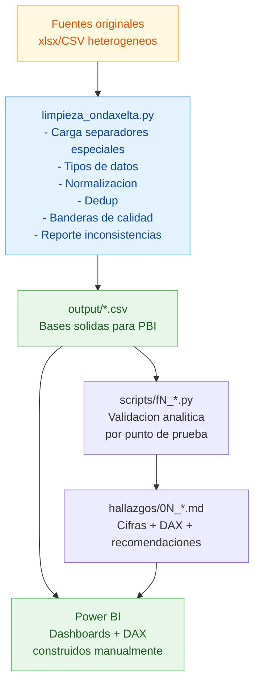
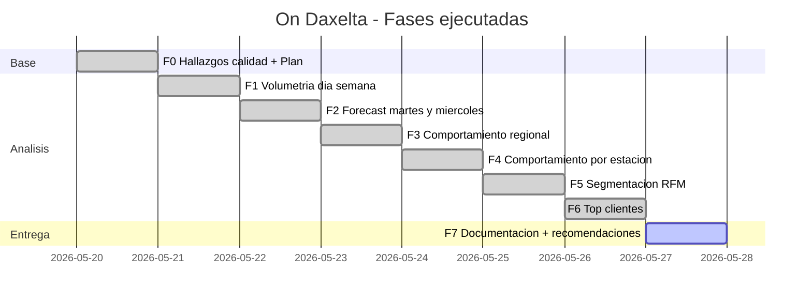
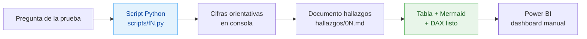

# Documentación del proceso y herramientas — Prueba On Daxelta

> Entregable según prueba: "Documente el proceso realizado y las herramientas utilizadas en la construcción del caso."

## 1. Herramientas utilizadas

| Capa | Herramienta | Versión | Uso |
|------|-------------|---------|-----|
| **Preparación de datos** | Python | 3.9+ | Limpieza, validación, scoring |
| | pandas | 2.x | Manipulación de DataFrames |
| | numpy | 1.x | Operaciones vectorizadas |
| | openpyxl | 3.x | Lectura `Customers.xlsx` y `Geo.xlsx` |
| **Visualización** | Power BI Desktop | latest | Dashboards y reportes |
| | DAX | — | Medidas, KPIs, segmentos calculados |
| **Documentación** | Markdown | CommonMark | Hallazgos, plan, recomendaciones |
| | Mermaid | latest | Diagramas (Gantt, EDT, dependencias, distribución) |
| **Versionado** | Git | 2.x | Trazabilidad de cambios |
| **Sistema** | Windows 11 + PowerShell | — | Entorno local de ejecución |

### Decisiones de stack

- **Python para limpieza, no SQL**: la data fuente está en archivos planos heterogéneos (CSV con separador `§`, XLSX, CSV con separador `£`). Cargarla a SQL implicaba parsear primero. Más directo en pandas.
- **Power BI para visualización (no matplotlib/plotly)**: requerimiento explícito del usuario. Permite que el analista valide DAX y reproduzca medidas manualmente.
- **DAX para las medidas, no columnas precalculadas en CSV**: mantiene trazabilidad — cualquier usuario puede ver la fórmula directamente en PBI. Solo se precalculan banderas de calidad (`FechaNac_confiable`, `cliente_identificado`, `EsInternacional`, `outlier_*`).
- **Markdown + Mermaid para entregables**: portables, versionables, renderizan en GitHub/Notion/Confluence/Obsidian sin dependencias.

## 2. Estructura del proyecto

```
analisis_datos/
├── PROCESO.md                       ← este documento
├── PLAN.md                          ← control multifase (F0–F7)
├── HALLAZGOS.md                     ← revisión inconsistencias + cardinalidades
├── RECOMENDACIONES.md               ← estandarización + reporte ejecutivo
├── CLAUDE.md                        ← carga obligatoria de skills (uso interno)
│
├── limpieza_ondaxelta.py            ← script principal de limpieza
│
├── (fuentes originales)
│   ├── Customers.xlsx
│   ├── Estaciones                   (CSV separador £, latin-1)
│   ├── Geo.xlsx
│   ├── Trans_Sem                    (CSV separador §, latin-1)
│   └── Trans_2_Sem                  (CSV separador §, header desplazado)
│
├── output/                          ← datos limpios para Power BI
│   ├── trans_clean.csv              (735.273 tx)
│   ├── customers_clean.csv          (801.337 clientes)
│   ├── estaciones_clean.csv         (407 estaciones)
│   ├── geo_clean.csv                (1.126 ciudades con flag EsInternacional)
│   └── reporte_inconsistencias.txt  (log auditable)
│
├── hallazgos/                       ← un documento por punto de la prueba
│   ├── 01_volumetria.md             ← punto 1: volumetría día semana
│   ├── 02_forecast.md               ← punto 2: pronóstico martes/miércoles
│   ├── 03_regional.md               ← punto 3: comportamiento regional
│   ├── 04_estaciones.md             ← punto 4: comportamiento por estación
│   ├── 05_rfm.md                    ← punto 5: segmentación RFM
│   └── 06_top_clientes.md           ← punto 6: clientes de mayor valor
│
└── scripts/                         ← scripts reproducibles por punto
    ├── f1_volumetria_dia_semana.py
    ├── f2_forecast_martes_miercoles.py
    ├── f3_regional.py
    ├── f4_estaciones.py
    ├── f5_rfm.py
    └── f6_top_clientes.py
```

## 3. Flujo de trabajo



## 4. Fases del proyecto (EDT)



## 5. Detalle del proceso de limpieza

### 5.1 Lectura de fuentes (no triviales)

| Archivo | Particularidad | Solución |
|---------|----------------|----------|
| `Customers.xlsx`   | XLSX estándar | `pd.read_excel` |
| `Geo.xlsx`         | XLSX estándar + nombres con espacios/saltos | `pd.read_excel` + `.str.strip()` |
| `Estaciones`       | CSV separador `£`, encoding `latin-1` | `pd.read_csv(sep='£', encoding='latin-1', engine='python')` |
| `Trans_Sem`        | CSV separador `§`, encoding `latin-1` | `pd.read_csv(sep='§', encoding='latin-1', engine='python')` |
| `Trans_2_Sem`      | Igual + **header desplazado vs contenido real** | Reasignación manual de `t2.columns` |

### 5.2 Política de tratamiento por entidad

| Entidad | Eliminados | Marcados (no eliminados) |
|---------|-----------:|--------------------------|
| Geo | 0 | 4 internacionales (`EsInternacional=True`) |
| Estaciones | 1 (IdEstacion=0 basura: sin tipo, sin ciudad) | 4 sin clasificar |
| Customers | 0 | 322.412 (40,2%) `FechaNac_confiable=False`; edad calculada solo donde confiable |
| Transacciones | 4.408 (4.406 duplicados exactos + 2 Gal≤0) | 137.383 sin cliente (`cliente_identificado=False`); 7.353+7.351 outliers (`outlier_valor`, `outlier_gal`) |

**Principio:** se elimina solo lo que es basura técnica sin posibilidad de relación. Todo lo demás se conserva con bandera, para que en Power BI el analista decida si filtrar o incluir en cada visual.

### 5.3 Normalización de categorías

- **TipoEstacion**: mapeo a dominio controlado `{Propia GNV, Franquiciada GNV, Operadora, Sin Clasificar}`. Captura variantes sucias: typos (`anquiciada GNV`), subtipos colapsados (`Franquiciada Banderazo GNV → Franquiciada GNV`), espacios/saltos (`\r\r\n`, espacios trailing).
- **Segmento (Customers)**: strip + `fillna("Sin Segmento")`. Log diferencia NaN técnico (1) vs literal `"Sin Segmento"` en fuente (165.542).
- **Placa**: strip de espacios.
- **IdCiudad, IdCliente, IdEstacion**: convertidos a `Int64` (nullable) para consistencia entre tablas.

### 5.4 Enriquecimiento

Columnas calculadas agregadas a `trans_clean.csv` para facilitar PBI:

| Columna | Tipo | Origen |
|---------|------|--------|
| `DiaSemana` | string | `FechaVenta.day_name()` |
| `DiaSemana_ES` | string | Mapeo manual a español |
| `NumeroDia` | int | 0=Lun … 6=Dom |
| `Semana` | int | ISO week |
| `Mes`, `Anio` | int | Atributos calendario |
| `PrecioXGalon` | float | `ValorVenta / Gal` |
| `cliente_identificado` | bool | `IdCliente != -99999` |
| `outlier_valor` | bool | `ValorVenta > p99` |
| `outlier_gal` | bool | `Gal > p99` |

### 5.5 Validación cruzada (integridad referencial)

Verificación de claves foráneas tras limpieza:

| Validación | Resultado |
|------------|-----------|
| Estaciones en tx sin maestro | **0** ✓ |
| IdCiudad en Customers sin match en Geo | 9 (ciudades fantasma) |
| IdCiudad en Estaciones sin match en Geo | **0** ✓ |

## 6. Detalle del proceso analítico

### 6.1 Patrón aplicado por cada punto (F1–F6)



### 6.2 Decisiones metodológicas críticas

| Punto | Decisión | Por qué |
|-------|----------|---------|
| F1 Volumetría | Ordenar lun→dom con `OrdenDia` en PBI | Evita el orden alfabético por defecto |
| F2 Forecast | Naive estacional + banda CV inter-día | Solo 7 días → ARIMA/Prophet/HW imposibles |
| F3 Regional | Conservar 4 internacionales con flag | No perder relación con 13.364 clientes |
| F4 Estaciones | Reportar inactivas del maestro (128 = 31,5%) | Detectar problema de calidad del catálogo |
| F5 RFM | R con scoring manual, no `qcut` | Con 7 días qcut colapsa bins |
| F5 RFM | Cruzar con edad/segmento/dpto/flotas | RFM puro no caracteriza al cliente |
| F6 Top | Separar Top 1% como cluster corporativo | 63% son flotas → KAM, no programa masivo |

### 6.3 Bugs detectados y corregidos vs script previo

| Bug | Versión previa | Corrección |
|-----|----------------|------------|
| Geo Colombia separada | Eliminaba 4 internacionales y 1 ciudad `IdCiudad=0` | Conservadas con flag |
| Segmento log subestimado | Reportaba 1 nulo | Diferencia NaN (1) vs literal (165.542) |
| Forecast usaba `.values[0]` | Tomaba primer martes solamente | Promedio + identidad con 7 días |
| Banda ±10% arbitraria | Hardcoded | CV real de la semana |
| R score `(4 - x).clip(1,5)` | Sospechoso, redondeaba mal | Scoring manual explícito por día |
| Resumen hardcoded `~15,2%` | Cifras literales en código | Eliminado, cifras solo en documentos |
| Excel de 8 hojas | Generaba resultados pre-cocidos | Eliminado, datos crudos para DAX |

## 7. Reproducir el análisis desde cero

### 7.1 Requisitos

```bash
pip install pandas numpy openpyxl
```

### 7.2 Ejecución

```bash
# 1. Limpieza (genera output/*.csv y reporte)
python limpieza_ondaxelta.py

# 2. Validación analítica por punto
python scripts/f1_volumetria_dia_semana.py
python scripts/f2_forecast_martes_miercoles.py
python scripts/f3_regional.py
python scripts/f4_estaciones.py
python scripts/f5_rfm.py
python scripts/f6_top_clientes.py
```

### 7.3 En Power BI

1. Abrir Power BI Desktop
2. **Obtener datos → CSV** → cargar los 4 archivos de `output/`
3. Establecer relaciones en el modelo:
   - `trans_clean[IdEstacion]` → `estaciones_clean[IdEstacion]` (muchos a uno)
   - `estaciones_clean[IdCiudad]` → `geo_clean[IdCiudad]` (muchos a uno)
   - `trans_clean[IdCliente]` → `customers_clean[IdCliente]` (muchos a uno)
   - `customers_clean[IdCiudad]` → `geo_clean[IdCiudad]` (muchos a uno, inactiva si genera ambigüedad)
4. Crear tabla calendario manual o `CALENDAR(MIN, MAX)`
5. Pegar las medidas DAX de cada `hallazgos/0N_*.md` en el modelo
6. Construir visuales según el checklist al final de cada documento

## 8. Ventana de datos cubierta

- **Periodo:** 2017-07-24 a 2017-07-30 (7 días, 1 semana calendario)
- **Año de referencia para edad:** 2017 (constante `ANIO_REF` en limpieza)
- **Trans_Sem y Trans_2_Sem:** dos sistemas paralelos sobre la misma semana, no semanas distintas (verificado, ver `HALLAZGOS.md` sección 2.5)

## 9. Limitaciones del entregable

1. **1 sola semana de datos**: forecast e inferencias estacionales son orientativas. Para conclusiones robustas se requieren ≥ 8 semanas.
2. **40,2% de FechaNac no confiable**: análisis demográfico (edad) sesgado.
3. **18,7% de transacciones sin IdCliente**: subestima el valor real por cliente identificado y reduce cobertura del RFM.
4. **Sin metadata operativa** (horario de estación, tipo de vehículo del cliente, sector económico): inferencia "≥4 placas = flota" es proxy aproximado.
5. **Geo carece de coordenadas (lat/long)**: visualización de mapa solo a nivel departamento/ciudad, no por punto.

## 10. Estandarización aplicada al entregable

| Tipo de archivo | Convención |
|-----------------|------------|
| CSV de salida | UTF-8 con BOM (`utf-8-sig`) para compatibilidad Excel/PBI |
| Documentos `.md` | Encabezados jerárquicos H1-H4, tablas con alineación numérica, Mermaid para diagramas |
| Scripts Python | Docstring obligatorio, encoding UTF-8 forzado en stdout (Windows), funciones puras separadas |
| Nomenclatura | `fN_` prefijo para correspondencia con punto de prueba, `_clean.csv` sufijo para data limpia |

Para recomendaciones detalladas de estandarización al **sistema fuente** (no al entregable), ver `RECOMENDACIONES.md`.
