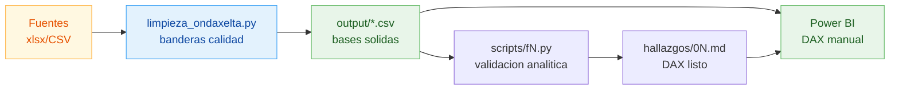

# Prueba Analista de Datos — On Daxelta

Análisis de comportamiento del negocio de gas vehicular On Daxelta a partir de las bases `Customers`, `Estaciones`, `Geo`, `Trans_Sem` y `Trans_2_Sem`. Limpieza en Python, bases sólidas en CSV para Power BI, dashboards y medidas DAX construidos manualmente sobre la data limpia.

**Ventana de datos:** 7 días (24-30 jul 2017)
**Estado:** completado — los 6 puntos de la prueba + documentación + recomendaciones

---

## Tabla de contenidos

### Documentos principales
- [`PROCESO.md`](PROCESO.md) — proceso completo y herramientas utilizadas
- [`RECOMENDACIONES.md`](RECOMENDACIONES.md) — estandarización + reporte ejecutivo de inconsistencias
- [`HALLAZGOS.md`](HALLAZGOS.md) — análisis técnico de calidad de datos
- [`PLAN.md`](PLAN.md) — control multifase del proyecto

### Hallazgos por punto de la prueba
| # | Punto | Documento |
|--:|-------|-----------|
| 1 | Volumetría galonaje por día semana | [`hallazgos/01_volumetria.md`](hallazgos/01_volumetria.md) |
| 2 | Pronóstico valor venta martes/miércoles | [`hallazgos/02_forecast.md`](hallazgos/02_forecast.md) |
| 3 | Comportamiento por regional | [`hallazgos/03_regional.md`](hallazgos/03_regional.md) |
| 4 | Comportamiento por estación | [`hallazgos/04_estaciones.md`](hallazgos/04_estaciones.md) |
| 5 | Segmentación de clientes (RFM) | [`hallazgos/05_rfm.md`](hallazgos/05_rfm.md) |
| 6 | Clientes de mayor valor | [`hallazgos/06_top_clientes.md`](hallazgos/06_top_clientes.md) |

---

## Quickstart

### Requisitos
```bash
pip install pandas numpy openpyxl
```

### Ejecutar limpieza
```bash
python limpieza_ondaxelta.py
```
Genera `output/*.csv` y `output/reporte_inconsistencias.txt`.

### Validar análisis por punto
```bash
python scripts/f1_volumetria_dia_semana.py
python scripts/f2_forecast_martes_miercoles.py
python scripts/f3_regional.py
python scripts/f4_estaciones.py
python scripts/f5_rfm.py
python scripts/f6_top_clientes.py
```

### Power BI
1. Cargar los 4 CSV de `output/` en Power BI Desktop
2. Definir relaciones (ver `PROCESO.md` §7.3)
3. Pegar las medidas DAX desde cada `hallazgos/0N_*.md`
4. Construir visuales según checklist al final de cada documento

---

## Estructura del proyecto

```
analisis_datos/
├── README.md                        ← este archivo
├── PROCESO.md                       ← proceso + herramientas
├── RECOMENDACIONES.md               ← estandarización + reporte inconsistencias
├── HALLAZGOS.md                     ← calidad de datos + cardinalidades
├── PLAN.md                          ← control multifase
│
├── limpieza_ondaxelta.py            ← script principal de limpieza
├── PRUEBA.TXT                       ← enunciado original
│
├── (fuentes originales)
│   ├── Customers.xlsx
│   ├── Estaciones                   (CSV separador £, latin-1)
│   ├── Geo.xlsx
│   ├── Trans_Sem                    (CSV separador §, latin-1)
│   └── Trans_2_Sem                  (header desplazado)
│
├── output/                          ← datos limpios para Power BI
│   ├── trans_clean.csv              (735.273 tx)
│   ├── customers_clean.csv          (801.337 clientes)
│   ├── estaciones_clean.csv         (407 estaciones)
│   ├── geo_clean.csv                (1.126 ciudades con flag EsInternacional)
│   └── reporte_inconsistencias.txt  (log auditable)
│
├── hallazgos/                       ← uno por punto de la prueba
│   ├── 01_volumetria.md
│   ├── 02_forecast.md
│   ├── 03_regional.md
│   ├── 04_estaciones.md
│   ├── 05_rfm.md
│   └── 06_top_clientes.md
│
└── scripts/                         ← reproducible por punto
    ├── f1_volumetria_dia_semana.py
    ├── f2_forecast_martes_miercoles.py
    ├── f3_regional.py
    ├── f4_estaciones.py
    ├── f5_rfm.py
    └── f6_top_clientes.py
```

---

## Stack tecnológico

| Capa | Herramienta |
|------|-------------|
| Preparación | Python 3.9+, pandas, numpy, openpyxl |
| Visualización | Power BI Desktop + DAX |
| Documentación | Markdown + Mermaid |
| Versionado | Git |

Detalles y justificación en [`PROCESO.md`](PROCESO.md) §1.

---

## Hallazgos destacados

| Hallazgo | Cifra |
|----------|------:|
| Valor venta total semana | **$8.186M COP** |
| Galones totales | 5.440k gal |
| Transacciones limpias | 735.273 |
| Clientes con compras | 99.753 (12,4% del maestro) |
| Estaciones activas | 279 de 407 (31,5% inactivas) |
| Departamentos top 80% | **7 de 19** (Valle, Bogotá, Atlántico…) |
| Top 1% clientes son flotas | **63%** (8,6 placas promedio) |
| Pico semanal | viernes (15,4% galones) |
| Valle semanal | domingo (12,1% galones) |
| Tx sin atribución | **17% del valor** ($1.388M no asignados) |

### Inconsistencias
- **5 críticos** (header Trans_2_Sem, IdEstacion=0, TipoEstacion nulo, FechaNac nula, nacidos >2017)
- **12 advertencias** (40% FechaNac no confiable, 20% sin segmento real, 51% Propias inactivas, etc.)
- **10 informativos**

Detalle completo en [`RECOMENDACIONES.md`](RECOMENDACIONES.md).

---

## Flujo de trabajo



---

## Decisiones de diseño

1. **Bases sólidas, no resultados pre-cocidos** — los CSV de `output/` contienen data limpia con banderas de calidad. Los KPIs, segmentos y rankings se construyen en Power BI con DAX para mantener trazabilidad.
2. **Conservar antes que eliminar** — solo se eliminan registros que son basura técnica (IdEstacion=0 sin tipo, duplicados exactos, Gal≤0). Todo lo demás se marca con flag (`EsInternacional`, `FechaNac_confiable`, `cliente_identificado`, `outlier_valor`, `outlier_gal`).
3. **Honestidad metodológica** — con solo 7 días de data, se descartan ARIMA/Prophet/Holt-Winters para el forecast. Se usa naive estacional con banda CV real, y se documenta la limitación.
4. **Caracterización demográfica del RFM** — el RFM puro mide valor pero no perfila. Se cruza con edad, segmento original, geografía y flotas para entender quiénes son los segmentos.
5. **Documentación reproducible** — cada cifra de los hallazgos tiene un script Python que la regenera (`scripts/`). No hay números mágicos en los documentos.

---

## Cumplimiento de la prueba

| Requerimiento | Entregable |
|--------------|------------|
| 1. Volumetría galonaje día semana | `hallazgos/01_volumetria.md` |
| 2. Pronóstico valor venta mar/mié | `hallazgos/02_forecast.md` |
| 3. Comportamiento regional | `hallazgos/03_regional.md` |
| 4. Comportamiento por estación | `hallazgos/04_estaciones.md` |
| 5. Segmentación clientes + caracterización | `hallazgos/05_rfm.md` |
| 6. Clientes de mayor valor | `hallazgos/06_top_clientes.md` |
| Documente proceso y herramientas | `PROCESO.md` |
| Recomendaciones estandarización + inconsistencias | `RECOMENDACIONES.md` + `output/reporte_inconsistencias.txt` |

---

## Autor

Esteban — analista de datos
