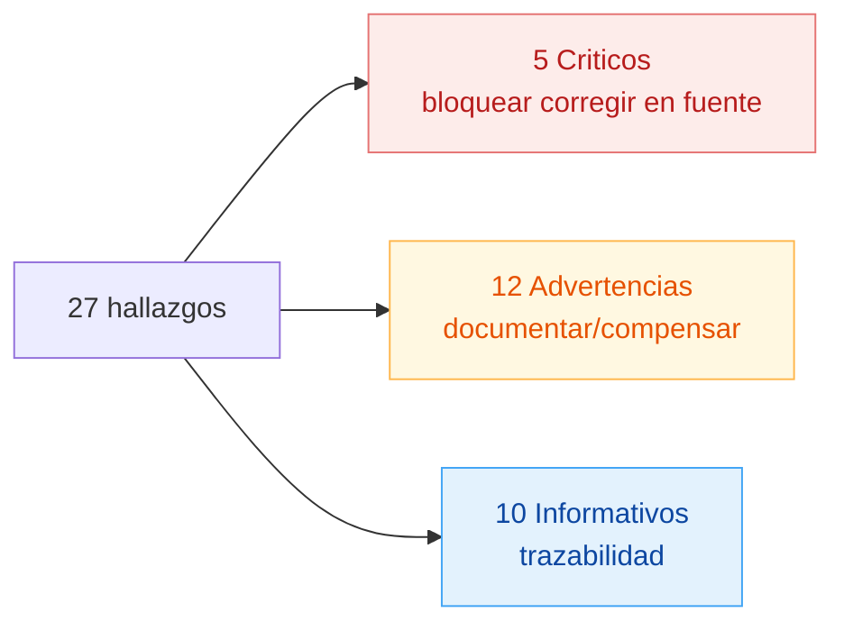
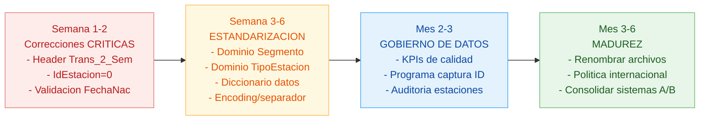

# Recomendaciones de estandarización y reporte de inconsistencias — On Daxelta

> Entregable según prueba: "Genere recomendaciones sobre la estandarización de la información y reporte de inconsistencias en caso de encontrar problemas con la data entregada para el análisis."

## 1. Resumen ejecutivo

| Concepto | Cifra |
|----------|------:|
| Archivos fuente analizados | 5 |
| Registros totales procesados | 1.541.018 |
| Registros finales (post-limpieza) | 802.583 (limpios) + 1.126 geo + 407 estaciones |
| Hallazgos críticos | **5** |
| Hallazgos advertencia | **12** |
| Hallazgos informativos | **10** |
| Recomendaciones de estandarización | **12** |

## 2. Inconsistencias detectadas por archivo

### 2.1 `Customers.xlsx`

| # | Severidad | Hallazgo | Cantidad |
|--:|-----------|----------|---------:|
| 1 | **CRÍTICO** | FechaNacimiento nula | 19.708 |
| 2 | **CRÍTICO** | Nacidos después de 2017 (imposible) | 89 |
| 3 | ADVERT | Edad < 16 años (no titulares legales) | 114.774 |
| 4 | ADVERT | Edad > 90 años (verificar) | 187.930 |
| 5 | ADVERT | Segmento NaN (nulo técnico) | 1 |
| 6 | ADVERT | Segmento `"Sin Segmento"` literal en fuente | 165.542 |
| 7 | ADVERT | TipoEstacion con variantes sucias (espacios, `\r\r\n`, typos) | 8 variantes |
| 8 | INFO | FechaNac NO confiable (marcada `FechaNac_confiable=False`) | 322.412 (40,2%) |

**Total real sin segmento clasificable:** 165.543 (20,7% de la base) — el reporte original subestimaba el problema en factor 165.000×.

### 2.2 `Estaciones`

| # | Severidad | Hallazgo | Cantidad |
|--:|-----------|----------|---------:|
| 1 | **CRÍTICO** | IdEstacion = 0 (fila basura: sin tipo, sin ciudad) | 1 |
| 2 | **CRÍTICO** | TipoEstacion nulo | 5 |
| 3 | ADVERT | Sin clasificar tras normalizar | 4 |
| 4 | ADVERT | 128 estaciones del maestro sin transacciones en la semana | 31,5% |
| 5 | INFO | Distribución final: Franquiciada 251 · Propia 107 · Operadora 45 · Sin Clasificar 4 | — |

**Alerta operativa:** 51,4% de las estaciones Propias no operaron. Posibles causas: cerradas, mantenimiento, maestro obsoleto.

### 2.3 `Geo.xlsx`

| # | Severidad | Hallazgo | Cantidad |
|--:|-----------|----------|---------:|
| 1 | ADVERT | IdCiudad < 0 (México, Chile, Perú, Venezuela) — conservadas con flag `EsInternacional` | 4 |
| 2 | INFO | IdCiudad = 0 (`NO DEFINIDA (COLOMBIA)`) — bandera para sin geo precisa | 1 |
| 3 | INFO | Total final: 1.122 Colombia + 4 internacionales = 1.126 ciudades | — |

### 2.4 `Trans_2_Sem`

| # | Severidad | Hallazgo | Impacto |
|--:|-----------|----------|---------|
| 1 | **CRÍTICO** | Header desplazado respecto al contenido real | 369.498 filas afectadas |

**Header incorrecto en fuente:** `FechaVenta, Placa, IdCliente, IdEstacion, ValorVenta, Gal_Fid, Gal`
**Orden real del contenido:** `Placa, IdCliente, IdEstacion, ValorVenta, Gal_Fid, Gal, FechaVenta`

### 2.5 `Trans_Sem` y `Trans_2_Sem` (unificadas)

| # | Severidad | Hallazgo | Cantidad |
|--:|-----------|----------|---------:|
| 1 | INFO | Nomenclatura engañosa: ambos archivos cubren la misma semana (24-30 jul 2017) | — |
| 2 | INFO | Antes dedup: 739.681 (Sem 370.183 + 2_Sem 369.498) | — |
| 3 | ADVERT | Duplicados exactos eliminados (solapamiento ~1% entre sistemas paralelos) | 4.406 |
| 4 | ADVERT | Sin IdCliente (-99999) — conservados marcados | 137.383 (18,7%) |
| 5 | ADVERT | Gal ≤ 0 (eliminados) | 2 |
| 6 | INFO | Outliers ValorVenta > $34.392 (marcados) | 7.353 |
| 7 | INFO | Outliers Gal > 22,06 (marcados) | 7.351 |
| 8 | ADVERT | Clientes en tx sin ficha en Customers | 2.055 |
| 9 | INFO | Registros finales limpios | 735.273 |

### 2.6 Validación cruzada (integridad referencial)

| # | Severidad | Hallazgo | Cantidad |
|--:|-----------|----------|---------:|
| 1 | INFO | Estaciones en tx sin maestro | 0 ✓ |
| 2 | ADVERT | IdCiudad en Customers sin match en Geo (Col+Intl) | 9 |
| 3 | INFO | IdCiudad en Estaciones sin match en Geo | 0 ✓ |

### 2.7 Modelo relacional (cardinalidades)

| # | Severidad | Hallazgo | Detalle |
|--:|-----------|----------|---------|
| 1 | INFO | IdCliente ↔ Placa es muchos-a-muchos | 82% clientes con 1 placa, 5% con 4+ (flotas) |
| 2 | INFO | 21% de placas tienen más de 1 cliente asociado | Rotación (taxis/empresas) o errores |

## 3. Recomendaciones de estandarización

> Agrupadas por origen del problema. Priorizadas según severidad e impacto operativo.

### 3.1 Sistema fuente (data entry / aplicaciones operativas)

#### R1 — Header desplazado en `Trans_2_Sem` 🔴 CRÍTICO

**Problema:** el header del archivo no corresponde al orden real del contenido. Afecta 369.498 filas (49,9% del universo transaccional).

**Acción:**
- Corregir el header en el sistema fuente al orden correcto: `Placa | IdCliente | IdEstacion | ValorVenta | Gal_Fid | Gal | FechaVenta`
- Implementar validación en el pipeline de exportación que compare la posición del campo con su tipo esperado (ej. FechaVenta debe ser parseable como fecha).

#### R2 — Validación de FechaNacimiento en captura 🔴 CRÍTICO

**Problema:** 19.708 nulas + 89 nacidos después de 2017 + 114.774 menores de 16 + 187.930 mayores de 90. Total **40,2% no confiable**.

**Acción:**
- **Hard validation en captura**: rechazar fechas futuras y `año_actual - año_nac < 16`.
- **Soft validation**: alerta para `año_actual - año_nac > 90` (revisión manual o requerir copia documento).
- Hacer obligatorio el campo (eliminar NaN técnico).

#### R3 — Eliminar `"Sin Segmento"` como categoría válida 🟡 ADVERTENCIA

**Problema:** 165.542 clientes (20,7%) tienen literalmente `"Sin Segmento"` en la fuente. No es un nulo, es una categoría declarada.

**Acción:**
- Dominio controlado: `{SUSTENTO, RECORRIDO, NEGOCIO}` — eliminar la opción "Sin Segmento" del formulario.
- Si el segmento no se conoce en el momento de creación del cliente, enrutar a un **flujo de asignación posterior** (encuesta, primera compra, llamada).

#### R4 — Estandarizar TipoEstacion con dominio cerrado 🟡 ADVERTENCIA

**Problema:** 8 variantes detectadas (`Propia GNV`, `Operadora`, `Franquiciada GNV`, `Franquiciada Banderazo GNV`, `anquiciada GNV`, ` Operadora `, `Franquiciada GNV \r\r\n`, ` Franquiciada GNV             `).

**Acción:**
- Dominio cerrado: `{Propia GNV, Franquiciada GNV, Operadora}`. Tratar `Banderazo` como **subtipo** en columna separada.
- Validar en captura: sin espacios al inicio/fin, sin saltos de línea, sin typos.
- Migración: corregir las 5 filas con TipoEstacion nulo en el maestro.

#### R5 — Eliminar la fila basura `IdEstacion = 0` 🔴 CRÍTICO

**Problema:** registro con IdEstacion=0, IdCiudad=0, TipoEstacion=NaN. Sin posibilidad de relación con tx.

**Acción:**
- Eliminar de la fuente.
- Restringir el campo IdEstacion en el maestro a `> 0` por constraint de BD.

#### R6 — Definir política de IdCliente = -99999 🟡 ADVERTENCIA

**Problema:** 137.383 transacciones (18,7%) sin cliente identificado. Representan **$1.387.967.592 COP** (17% del valor) no atribuibles.

**Acción:**
- **Programa de captura agresivo en punto de venta**: token, QR, app móvil, SMS, código fidelidad.
- Meta: reducir el "sin identificar" del 18,7% al ≤ 5%.
- ROI: cada punto recuperado equivale a ~$80M COP/semana atribuibles.

#### R7 — Sincronización del maestro Customers 🟡 ADVERTENCIA

**Problema:** 2.055 IdCliente aparecen en transacciones pero no existen en `Customers.xlsx`.

**Acción:**
- Investigar latencia: ¿los clientes son nuevos en la semana y aún no se han sincronizado?
- Implementar carga incremental diaria del maestro de clientes (no batch semanal/mensual).

#### R8 — Auditoría del maestro de Estaciones Propias 🟡 ADVERTENCIA

**Problema:** 55 estaciones Propias (51% del parque propio) no operaron en la semana.

**Acción:**
- Auditoría operativa estación por estación: ¿cerradas, en mantenimiento, dadas de baja, falla de captura?
- Dar de baja del maestro las que estén cerradas definitivamente.
- Marcar con flag `Estado` (Activa / Inactiva / Mantenimiento / Cerrada).

### 3.2 Nomenclatura y diccionario de datos

#### R9 — Renombrar `Trans_Sem` y `Trans_2_Sem` 🔵 INFO

**Problema:** los nombres sugieren "semana 1 y semana 2" pero ambos cubren la misma semana (24-30 jul 2017) sobre las mismas 279 estaciones. Son dos sistemas paralelos.

**Acción:**
- Renombrar a `Trans_SistemaA` y `Trans_SistemaB` (o nombres reales del origen).
- **Mejor opción:** consolidar en una sola fuente con campo `OrigenSistema` para trazabilidad.

#### R10 — Diccionario de datos formal 🟡 ADVERTENCIA

**Problema:** no existe diccionario de datos. Cada archivo trae sus propios separadores, encoding, y convenciones.

**Acción:**
- Crear documento `DICCIONARIO_DATOS.md` con: nombre del campo, tipo, dominio, restricciones, nullable, descripción, ejemplo.
- Versionar el diccionario junto con la data.

### 3.3 Pipeline de exportación

#### R11 — Estandarizar encoding y separador 🟡 ADVERTENCIA

**Problema:** archivos con separadores no estándar (`§`, `£`) y encoding `latin-1`. Riesgo de caracteres mal decodificados, archivos inutilizables sin scripts personalizados.

**Acción:**
- **Estándar de exportación:** CSV con separador `,` o `;`, encoding `UTF-8` (con BOM si destino es Excel).
- Manejar correctamente caracteres especiales (ñ, tildes) en UTF-8.

#### R12 — Política de internacionales clara 🔵 INFO

**Problema:** 4 ciudades internacionales (México, Chile, Perú, Venezuela) tienen IdCiudad negativo (-1 a -4). Hoy se conservan con flag `EsInternacional`, pero la decisión operativa no está formalizada.

**Acción:**
- Definir: ¿son operación real, ambiente de prueba, o data residual?
- Si son operación: asignar IDs positivos coherentes con el rango Colombia.
- Si son test: marcar explícitamente con campo `Ambiente = 'TEST'` y excluir por defecto de reportes.

## 4. Reporte de inconsistencias — generación automatizada

Cada ejecución de `limpieza_ondaxelta.py` genera `output/reporte_inconsistencias.txt` con:

- Hallazgos por archivo (CRÍTICO / ADVERTENCIA / INFO)
- Cantidades exactas afectadas
- Resumen ejecutivo (totales por severidad)
- Recomendaciones de estandarización

Esto permite que cada vez que llegue nueva data, el equipo detecte automáticamente si las inconsistencias antiguas persisten o si aparecen nuevas.

## 5. Indicadores de calidad propuestos (KPIs de gobierno de datos)

| KPI | Cálculo actual | Meta |
|-----|---------------:|-----:|
| % Transacciones con IdCliente | 81,3% | ≥ 95% |
| % FechaNacimiento confiable | 59,8% | ≥ 90% |
| % Clientes con Segmento clasificado | 79,3% | 100% |
| % Estaciones activas / maestro | 68,5% | ≥ 90% |
| % Integridad referencial (Trans→Est) | 100% ✓ | 100% |
| % Integridad referencial (Cust→Geo) | 99,99% (9 sin match) | 100% |

Estos KPIs deberían medirse semanalmente y reportarse al área de operación.

## 6. Roadmap sugerido de implementación

## 7. Resumen ejecutivo (para presentar al cliente)

> La data entregada permite realizar el análisis solicitado, pero presenta **5 problemas críticos** y **12 advertencias** que afectan la confiabilidad de algunos resultados:
>
> 1. **17% de las ventas no se atribuyen a ningún cliente** ($1.388M COP). Es la mayor palanca de mejora operativa.
> 2. **40% de las fechas de nacimiento no son confiables**, lo que sesga cualquier análisis demográfico.
> 3. **20% de los clientes no tiene segmento real** (el valor "Sin Segmento" es categoría literal, no nulo).
> 4. **El header del archivo Trans_2_Sem está desfasado** del contenido — requiere corrección urgente en origen.
> 5. **51% de las estaciones Propias no operaron** en la semana — alerta de mantenimiento del maestro o estado real.
>
> Los datos están **conservados sin pérdida innecesaria** (4 internacionales, 1 ciudad "no definida", 322k fechas dudosas, 137k tx sin cliente, 7k+ outliers) gracias a un sistema de **banderas de calidad** que permite filtrar selectivamente en Power BI sin volver a procesar.
>
> Se entregan **12 recomendaciones priorizadas** por bloque (sistema fuente, nomenclatura, pipeline) con un **roadmap de implementación a 6 meses**.

---

**Documentos relacionados:**
- `PROCESO.md` — proceso completo y herramientas
- `HALLAZGOS.md` — análisis técnico detallado con Mermaid
- `output/reporte_inconsistencias.txt` — log auditable generado automáticamente
- `hallazgos/0N_*.md` — análisis por cada punto de la prueba
