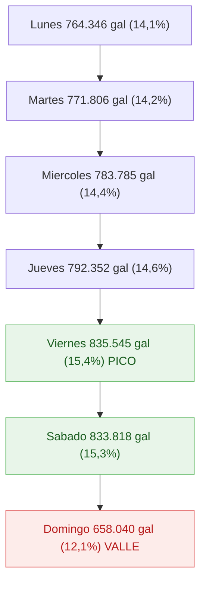

# F1 — Volumetría del galonaje por día de la semana

> Punto 1 de la prueba. Orientación cuantitativa + medidas DAX listas para Power BI.

## 1. Ventana de análisis

- **Periodo:** 24-jul-2017 a 30-jul-2017 (7 días, 1 semana calendario)
- **Días únicos:** 7 (lunes a domingo)
- **Transacciones limpias:** 735.273
- **Galones totales:** 5.439.692
- **Valor venta total:** $8.186.473.842 COP

## 2. Cifras por día de la semana

| Día | Galones | %Gal | Valor venta | %Val | Tickets | Clientes únicos | Gal/Tx | Ticket prom |
|-----|--------:|-----:|------------:|-----:|--------:|----------------:|-------:|------------:|
| Lunes     |   764.346 | 14,1% | $1.152.150.456 | 14,1% | 101.977 | 52.520 | 7,50 | $11.298 |
| Martes    |   771.806 | 14,2% | $1.164.495.517 | 14,2% | 103.706 | 52.922 | 7,44 | $11.229 |
| Miércoles |   783.785 | 14,4% | $1.182.080.425 | 14,4% | 104.494 | 53.166 | 7,50 | $11.312 |
| Jueves    |   792.352 | 14,6% | $1.195.686.203 | 14,6% | 106.647 | 53.633 | 7,43 | $11.212 |
| Viernes   |   835.545 | 15,4% | $1.258.091.571 | 15,4% | 111.469 | 55.024 | 7,50 | $11.286 |
| Sábado    |   833.818 | 15,3% | $1.249.507.378 | 15,3% | 113.606 | 55.288 | 7,34 | $10.999 |
| Domingo   |   658.040 | 12,1% |   $984.462.292 | 12,0% |  93.374 | 45.804 | 7,05 | $10.543 |

## 3. Distribución visual del galonaje



## 4. Hallazgos

1. **Pico viernes-sábado** — concentran 30,7% del galonaje semanal. Día más alto: viernes (835.545 gal).
2. **Valle domingo** — 12,1% (658.040 gal). Brecha pico/valle: **+27%** (viernes vs domingo).
3. **Días hábiles (lun-vie)** crecen monotónicamente: lunes 14,1% → viernes 15,4%. Acumulación de demanda hacia fin de semana laboral.
4. **Ticket promedio estable** entre $10.543 y $11.312 (variación de solo 7,3%). Lo que mueve la volumetría es el número de tickets, no el tamaño.
5. **Galones por transacción casi constantes** (7,05 a 7,50 gal). El comportamiento de compra unitario no cambia entre días.
6. **Clientes únicos por día siguen el mismo patrón** que tickets: viernes-sábado atraen 55k clientes, domingo solo 45k (-17%).
7. **Sábado tiene más tickets que viernes** (113.606 vs 111.469) pero menos galones — sábado vende más transacciones pequeñas (Gal/Tx 7,34 vs 7,50).

## 5. Medidas DAX para Power BI

> Asume modelo: `Trans` (transacciones), relación `Trans[FechaVenta]` con tabla calendario `Calendario[Fecha]`.

### 5.1 Métricas base

```dax
Total Galones :=
SUM ( Trans[Gal] )

Valor Venta :=
SUM ( Trans[ValorVenta] )

Total Tickets :=
COUNTROWS ( Trans )

Clientes Unicos :=
DISTINCTCOUNT ( Trans[IdCliente] )

Ticket Promedio :=
DIVIDE ( [Valor Venta], [Total Tickets] )

Gal por Tx :=
DIVIDE ( [Total Galones], [Total Tickets] )
```

### 5.2 Participación porcentual

```dax
Pct Galones Dia :=
DIVIDE (
    [Total Galones],
    CALCULATE ( [Total Galones], ALL ( Calendario[NombreDia] ) )
)

Pct Valor Dia :=
DIVIDE (
    [Valor Venta],
    CALCULATE ( [Valor Venta], ALL ( Calendario[NombreDia] ) )
)
```

### 5.3 Ranking de días

```dax
Ranking Dia Gal :=
RANKX (
    ALL ( Calendario[NombreDia] ),
    [Total Galones],,
    DESC,
    DENSE
)
```

### 5.4 Diferencia pico/valle (medida ejecutiva)

```dax
Brecha Pico Valle Gal :=
VAR Max_ = MAXX ( ALL ( Calendario[NombreDia] ), [Total Galones] )
VAR Min_ = MINX ( ALL ( Calendario[NombreDia] ), [Total Galones] )
RETURN DIVIDE ( Max_ - Min_, Min_ )
```

### 5.5 Orden visual de días (tabla calendario)

Crear columna calculada en `Calendario` para ordenar correctamente lunes → domingo:

```dax
OrdenDia =
SWITCH (
    Calendario[NombreDia],
    "Lunes", 1,
    "Martes", 2,
    "Miércoles", 3,
    "Jueves", 4,
    "Viernes", 5,
    "Sábado", 6,
    "Domingo", 7,
    99
)
```

Luego en PBI: seleccionar columna `NombreDia` → Modelado → Ordenar por → `OrdenDia`.

## 6. Limitaciones

- **1 sola semana de datos** → no es posible distinguir patrón estacional vs variación aleatoria. El "pico viernes" podría ser específico de esa semana (¿día de pago? ¿quincena? ¿festivo? La semana del 24-30 jul 2017 no incluye festivo nacional colombiano).
- Para una conclusión robusta se necesitan **mínimo 8 semanas** del mismo periodo del año.

## 7. Recomendaciones operativas

1. **Reforzar capacidad operativa viernes-sábado** (atendedores, suministro, mantenimiento preventivo). Concentran ~31% de la demanda semanal.
2. **Programa de incentivo domingo** — desplazar parte de la demanda lunes-martes al domingo para suavizar la curva. El domingo opera al 79% del promedio (658k vs 776k gal/día prom).
3. **Auditar disponibilidad sábado** — más tickets pero menor Gal/Tx sugiere desabasto puntual o cambio de mix de cliente. Validar tiempos de espera.

## 8. Checklist visualización en Power BI

- [ ] Gráfico de columnas: `NombreDia` (eje) vs `Total Galones` (valor), ordenado por `OrdenDia`
- [ ] KPI card: `Brecha Pico Valle Gal` (mostrar como porcentaje)
- [ ] Tabla: NombreDia | Total Galones | Pct Galones Dia | Total Tickets | Clientes Unicos | Ticket Promedio
- [ ] Gráfico línea: tendencia diaria (FechaVenta vs Total Galones) para ver los 7 días reales
- [ ] Slicer por TipoEstacion y NombreDpto para análisis cruzado
