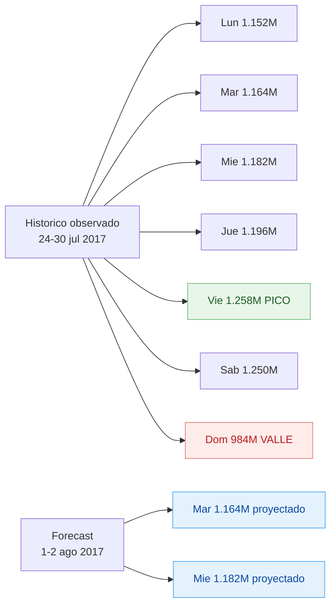

# F2 — Pronóstico Valor Venta martes y miércoles siguientes

> Punto 2 de la prueba. Pronóstico honesto + banda + medidas DAX.

## 1. Fechas a proyectar

| # | Fecha | Día |
|---|-------|-----|
| 1 | **2017-08-01** | Martes |
| 2 | **2017-08-02** | Miércoles |

Último día observado: 2017-07-30 (domingo). Las fechas proyectadas son los días siguientes en el calendario.

## 2. Resultado del pronóstico

| Día | Fecha | Valor proyectado | Banda −1σ | Banda +1σ | Galones proyectados | Banda −1σ Gal | Banda +1σ Gal |
|-----|-------|-----------------:|----------:|----------:|--------------------:|--------------:|--------------:|
| Martes    | 2017-08-01 | **$1.164.495.517** | $1.073.909.586 | $1.255.081.447 | **771.806** | 712.664 | 830.949 |
| Miércoles | 2017-08-02 | **$1.182.080.425** | $1.090.126.567 | $1.274.034.283 | **783.785** | 723.725 | 843.846 |

**Banda:** ±7,8% para valor venta · ±7,7% para galones (coeficiente de variación real observado en los 7 días).

## 3. Estadísticos base (semana observada)

| Estadístico | Valor Venta | Galones |
|-------------|------------:|--------:|
| Media diaria | $1.169.496.263 | 777.099 |
| Desviación estándar | $90.974.938 | 59.548 |
| Coeficiente de variación | **7,8%** | **7,7%** |
| Mínimo (domingo) | $984.462.292 | 658.040 |
| Máximo (viernes) | $1.258.091.571 | 835.545 |

## 4. Metodología

### 4.1 Restricción de datos

Solo hay **1 observación por día de semana** (1 lunes, 1 martes, 1 miércoles, ...). Esto descarta:

- ARIMA, SARIMA (requieren mínimo 2-3 ciclos = 14-21 días)
- Prophet (requiere ≥ 2 ciclos estacionales)
- Holt-Winters triple (requiere ≥ 2 ciclos)
- Regresión con dummies de día (no se puede estimar el coeficiente con 1 obs por nivel)

### 4.2 Métodos aplicados

**Método 1 — Naive estacional:** el pronóstico es el valor real observado del mismo día de la semana anterior.

```
Pronostico(d) = Observado(d - 7 dias)
```

**Método 2 — Media diaria × factor día:** se calcula la media diaria semanal y se multiplica por el factor estacional de cada día.

```
factor(d) = Observado(d) / Media_semanal
Pronostico(d) = Media_semanal * factor(d)
```

**Con 7 días de data, ambos métodos producen el mismo resultado**, porque `Media × (Obs/Media) = Obs`. Documentamos ambos para que el lector entienda la lógica del factor estacional cuando haya más datos disponibles.

### 4.3 Banda de confianza

Banda = pronóstico × (1 ± CV), donde CV es el coeficiente de variación de los 7 días observados.

Esto representa la variabilidad típica entre días distintos de la semana, no la variabilidad de "qué tanto puede variar un martes". Para banda real se necesitan múltiples observaciones por día semana.

## 5. Comparativo gráfico



## 6. Limitaciones (honestidad estadística)

1. **Una semana no es base para pronosticar.** El intervalo de confianza real es desconocido. La banda ±7,8% es una aproximación basada en variabilidad inter-día, no en variabilidad de la serie.
2. **No se puede detectar tendencia** (ascendente/descendente) con 7 puntos.
3. **No se puede detectar efectos calendario** (festivos, quincenas, fin de mes). La semana del 24-30 jul 2017 no incluye festivo nacional colombiano, pero podría coincidir con periodo de pago.
4. **Pronóstico fuera de muestra es extrapolación pura.** La asunción es que la semana próxima se comporta igual que la observada.
5. **Para un forecast confiable se requieren ≥ 8 semanas** del mismo periodo del año (idealmente 12+ meses para captar estacionalidad anual).

## 7. Medidas DAX para Power BI

> Asume tabla `Trans` con `FechaVenta`, `ValorVenta`, `Gal`. Tabla `Calendario` con `Fecha`, `NombreDia`, `NumeroDia` (0=Lun, 6=Dom). Crear tabla manual `Forecast` con las fechas a proyectar.

### 7.1 Histórico base

```dax
Valor Venta :=
SUM ( Trans[ValorVenta] )

Valor Promedio Diario :=
AVERAGEX (
    VALUES ( Calendario[Fecha] ),
    [Valor Venta]
)

CV Valor :=
DIVIDE (
    STDEVX.S ( VALUES ( Calendario[Fecha] ), [Valor Venta] ),
    [Valor Promedio Diario]
)
```

### 7.2 Pronóstico naive (mismo día semana anterior)

```dax
Forecast Valor :=
VAR FechaActual = SELECTEDVALUE ( Forecast[Fecha] )
VAR FechaReferencia = FechaActual - 7
RETURN
    CALCULATE (
        [Valor Venta],
        Calendario[Fecha] = FechaReferencia
    )
```

### 7.3 Banda inferior / superior

```dax
Forecast Valor Min :=
[Forecast Valor] * ( 1 - [CV Valor] )

Forecast Valor Max :=
[Forecast Valor] * ( 1 + [CV Valor] )
```

### 7.4 Para galones (análogo)

```dax
Total Galones :=
SUM ( Trans[Gal] )

Gal Promedio Diario :=
AVERAGEX ( VALUES ( Calendario[Fecha] ), [Total Galones] )

CV Galones :=
DIVIDE (
    STDEVX.S ( VALUES ( Calendario[Fecha] ), [Total Galones] ),
    [Gal Promedio Diario]
)

Forecast Galones :=
VAR FechaActual = SELECTEDVALUE ( Forecast[Fecha] )
VAR FechaReferencia = FechaActual - 7
RETURN
    CALCULATE ( [Total Galones], Calendario[Fecha] = FechaReferencia )

Forecast Galones Min := [Forecast Galones] * ( 1 - [CV Galones] )
Forecast Galones Max := [Forecast Galones] * ( 1 + [CV Galones] )
```

### 7.5 Tabla `Forecast` (crear manualmente en PBI)

| Fecha | DiaSemana |
|-------|-----------|
| 2017-08-01 | Martes |
| 2017-08-02 | Miércoles |

`Modelado → Nueva tabla → Ingresar datos` o `Forecast = DATATABLE(...)`.

## 8. Recomendaciones

1. **No presentar el pronóstico sin la banda y la limitación.** Un valor puntual sin contexto sugiere certeza que no existe.
2. **Solicitar ampliación de la ventana** — mínimo 8 semanas para una segunda iteración del análisis.
3. **Para una próxima entrega**, capturar y conservar 4-8 semanas consecutivas para poder aplicar:
   - Promedio móvil simple (4 semanas) por día
   - Holt-Winters para captar tendencia + estacionalidad semanal
   - Banda real basada en σ del mismo día semana

## 9. Checklist visualización en Power BI

- [ ] Crear tabla `Forecast` con las 2 fechas proyectadas
- [ ] Combo chart: línea histórica `Trans[FechaVenta]` vs `Valor Venta` + línea proyectada `Forecast[Fecha]` vs `Forecast Valor`
- [ ] Área de banda: `Forecast Valor Min` y `Forecast Valor Max`
- [ ] KPI cards: pronóstico martes y miércoles con banda
- [ ] Nota visible en el dashboard: *"Pronóstico basado en 1 semana de datos. Banda ±7,8% por variabilidad inter-día. No es un modelo de serie de tiempo."*
