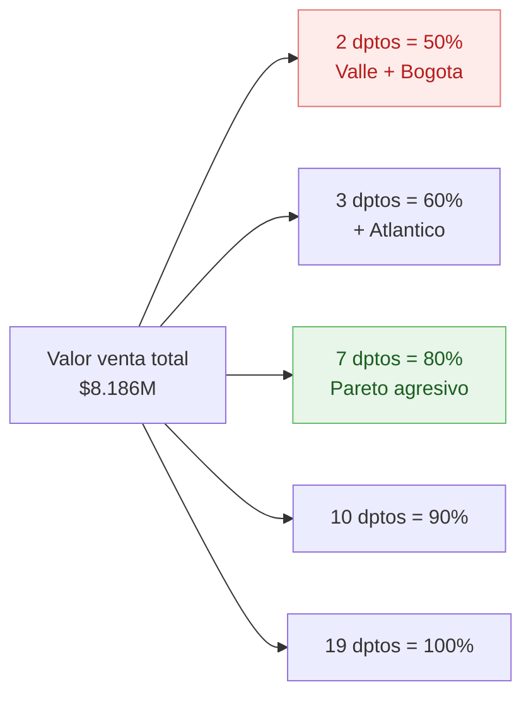
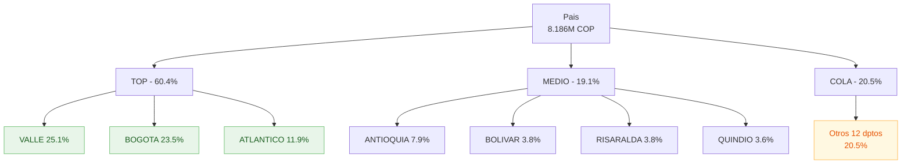

# F3 — Comportamiento por Regional (Departamento)

> Punto 3 de la prueba. Análisis por departamento + Pareto + ciudades + medidas DAX.

## 1. Cobertura

- **Departamentos con operación:** 19 de 33 (57,6% del territorio colombiano)
- **Transacciones sin geografía:** 0 ✓ (integridad referencial perfecta)
- **Estaciones activas:** 279
- **Ventana:** 7 días (24-30 jul 2017)

## 2. Top 15 departamentos por Valor Venta

| # | Departamento | Valor | %Valor | %Acum | Galones | Tickets | Clientes únicos | Estaciones | Tkt prom |
|--:|--------------|------:|-------:|------:|--------:|--------:|----------------:|-----------:|---------:|
|  1 | VALLE        | $2.051.892.815 | **25,1%** | 25,1% | 1.248.581 | 170.784 | 25.499 | 68 | $12.015 |
|  2 | BOGOTA       | $1.920.251.339 | **23,5%** | 48,5% | 1.292.871 | 164.987 | 23.648 | 40 | $11.639 |
|  3 | ATLANTICO    |   $970.260.508 | 11,9% | 60,4% |   742.009 | 124.482 | 10.456 | 37 |  $7.794 |
|  4 | ANTIOQUIA    |   $643.930.189 |  7,9% | 68,2% |   454.815 |  49.053 |  8.972 | 34 | $13.127 |
|  5 | BOLIVAR      |   $313.306.371 |  3,8% | 72,1% |   217.427 |  26.881 |  3.282 | 18 | $11.655 |
|  6 | RISARALDA    |   $312.216.574 |  3,8% | 75,9% |   193.598 |  25.222 |  4.690 | 10 | $12.379 |
|  7 | QUINDIO      |   $295.817.800 |  3,6% | **79,5%** | 169.437 |  21.182 |  4.120 |  7 | $13.966 |
|  8 | MAGDALENA    |   $272.456.741 |  3,3% | 82,8% |   205.963 |  32.332 |  2.942 |  8 |  $8.427 |
|  9 | CALDAS       |   $224.921.543 |  2,7% | 85,6% |   135.893 |  16.823 |  2.706 |  9 | $13.370 |
| 10 | CUNDINAMARCA |   $212.391.595 |  2,6% | 88,2% |   136.825 |  13.924 |  3.228 |  8 | **$15.254** |
| 11 | CORDOBA      |   $200.862.130 |  2,5% | 90,6% |   154.682 |  21.364 |  2.554 | 10 |  $9.402 |
| 12 | TOLIMA       |   $160.304.750 |  2,0% | 92,6% |    89.764 |  13.403 |  2.664 |  4 | $11.960 |
| 13 | SANTANDER    |   $156.198.753 |  1,9% | 94,5% |   100.520 |  15.122 |  1.840 |  7 | $10.329 |
| 14 | SUCRE        |   $146.536.953 |  1,8% | 96,3% |    99.325 |  13.110 |  1.933 |  7 | $11.177 |
| 15 | HUILA        |    $86.680.437 |  1,1% | 97,3% |    48.441 |   7.825 |  1.597 |  3 | $11.077 |

## 3. Concentración (Pareto)



**Lectura:** el 37% de los departamentos (7 de 19) concentra el 80% del valor venta. La operación está muy concentrada en el centro-occidente y caribe.

## 4. Top 10 ciudades

| # | Departamento | Ciudad | Valor | %Total |
|--:|--------------|--------|------:|-------:|
|  1 | BOGOTA    | BOGOTÁ D.C.   | $1.920.251.339 | **23,5%** |
|  2 | VALLE     | CALI          | $1.508.883.101 | **18,4%** |
|  3 | ATLANTICO | BARRANQUILLA  |   $848.784.755 | 10,4% |
|  4 | ANTIOQUIA | MEDELLIN      |   $400.286.895 |  4,9% |
|  5 | MAGDALENA | SANTA MARTA   |   $272.456.741 |  3,3% |
|  6 | BOLIVAR   | CARTAGENA     |   $264.847.499 |  3,2% |
|  7 | QUINDIO   | ARMENIA       |   $261.199.032 |  3,2% |
|  8 | RISARALDA | PEREIRA       |   $214.394.873 |  2,6% |
|  9 | CALDAS    | MANIZALES     |   $200.804.449 |  2,5% |
| 10 | VALLE     | PALMIRA       |   $198.345.437 |  2,4% |

**Top 4 ciudades = 57,2% del valor total.** El negocio es esencialmente urbano (capitales departamentales).

## 5. Hallazgos

1. **Dominancia bipolar Valle-Bogotá** — juntos hacen el 48,5% del valor. Cada uno por sí solo equivale a casi un cuarto del negocio.
2. **Valle distribuye, Bogotá concentra** — Bogotá tiene 1 sola ciudad (D.C.) que es 100% del departamento; Valle tiene Cali (73,5% del dpto) + Palmira + otras. Estrategia regional debe ser distinta.
3. **Atlántico = Barranquilla** — el dpto es prácticamente la ciudad. Misma lógica para Magdalena (Santa Marta) y Quindío (Armenia).
4. **Ticket promedio segmenta perfiles regionales:**
   - **Alto** ($13-15k): Cundinamarca, Quindío, Caldas, Antioquia → posible mix con vehículos de mayor consumo
   - **Bajo** ($7-9k): Atlántico, Magdalena, Córdoba → mayor proporción de motos/vehículos pequeños o usuarios de menor carga por visita
5. **Densidad estación-valor**:
   - **Más eficiente:** Cundinamarca ($26,5M/estación), Quindío ($42M/estación)
   - **Menos eficiente:** Sucre ($21M/estación), Magdalena ($34M/estación)
   - **Valle:** 68 estaciones con $30M c/u promedio
6. **Cobertura territorial limitada** — solo 19 de 33 departamentos. Sin presencia en: Amazonas, Vichada, Guainía, Vaupés, San Andrés, Chocó, Casanare, Putumayo, Caquetá, La Guajira, Cesar, N. Santander, Boyacá, Meta, Nariño, Cauca, Arauca (algunos podrían no tener mercado relevante).

## 6. Mapa de concentración



## 7. Medidas DAX para Power BI

> Asume relaciones: `Trans[IdEstacion]` → `Estaciones[IdEstacion]` → `Geo[IdCiudad]`.

### 7.1 Métricas base por dpto

```dax
Valor Venta :=
SUM ( Trans[ValorVenta] )

Total Galones :=
SUM ( Trans[Gal] )

Total Tickets :=
COUNTROWS ( Trans )

Clientes Unicos :=
DISTINCTCOUNT ( Trans[IdCliente] )

Estaciones Activas :=
DISTINCTCOUNT ( Trans[IdEstacion] )

Ticket Promedio :=
DIVIDE ( [Valor Venta], [Total Tickets] )

Valor por Estacion :=
DIVIDE ( [Valor Venta], [Estaciones Activas] )
```

### 7.2 Ranking y participación

```dax
Pct Valor Dpto :=
DIVIDE (
    [Valor Venta],
    CALCULATE ( [Valor Venta], ALL ( Geo[NombreDpto] ) )
)

Ranking Dpto :=
RANKX (
    ALL ( Geo[NombreDpto] ),
    [Valor Venta],,
    DESC,
    DENSE
)
```

### 7.3 Pareto (% acumulado)

```dax
Pct Acumulado Dpto :=
VAR ValorActual = [Valor Venta]
VAR Tabla =
    ADDCOLUMNS (
        ALL ( Geo[NombreDpto] ),
        "Val", [Valor Venta]
    )
RETURN
    DIVIDE (
        SUMX ( FILTER ( Tabla, [Val] >= ValorActual ), [Val] ),
        SUMX ( Tabla, [Val] )
    )
```

### 7.4 Top N filtrable

```dax
Es Top 7 Dpto :=
IF ( [Ranking Dpto] <= 7, "Top 7 (80%)", "Resto" )
```

Usar como leyenda en gráficos para separar visualmente el Pareto.

## 8. Limitaciones

- **Ventana de 7 días** — la mezcla regional puede variar por estacionalidad (vacaciones, festivos, dinámica turística). Santa Marta y Cartagena podrían tener picos en temporada alta que esta semana no captura.
- **No hay segmentación canal** (urbano/carretera/peri-urbano) en `Estaciones` — limita análisis de tipos de demanda regional.

## 9. Recomendaciones

1. **Programa de fidelización diferenciado por bloque:**
   - **Top 3 (Valle, Bogotá, Atlántico):** mantener servicio y maximizar fidelización (alto valor, alta competencia esperada)
   - **Bloque medio (Antioquia, Bolívar, Risaralda, Quindío):** crecimiento — apostar a captación de clientes
   - **Cola (12 dptos restantes):** evaluar costo-beneficio de mantener presencia
2. **Auditar densidad ticket × estación**: dptos como Cundinamarca y Quindío muestran ticket alto y dpto con pocas estaciones; replicar el modelo en dptos comparables (Tolima, Santander).
3. **Bogotá D.C. en 40 estaciones** vs **Valle en 68 estaciones** generan valor similar. Evaluar si Bogotá necesita más cobertura o si la capacidad actual es suficiente.

## 10. Checklist visualización en Power BI

- [ ] Mapa coroplético: `Geo[NombreDpto]` × `Valor Venta`
- [ ] Treemap: jerarquía Departamento → Ciudad por `Valor Venta`
- [ ] Gráfico combinado (Pareto): barras `Valor Venta` + línea `Pct Acumulado Dpto`
- [ ] Tabla detalle: Dpto | Valor | %Valor | %Acum | Estaciones | Ticket Prom | Clientes
- [ ] Slicer por `TipoEstacion` y por `Es Top 7 Dpto`
- [ ] KPI: "7 dptos hacen el 80%"
