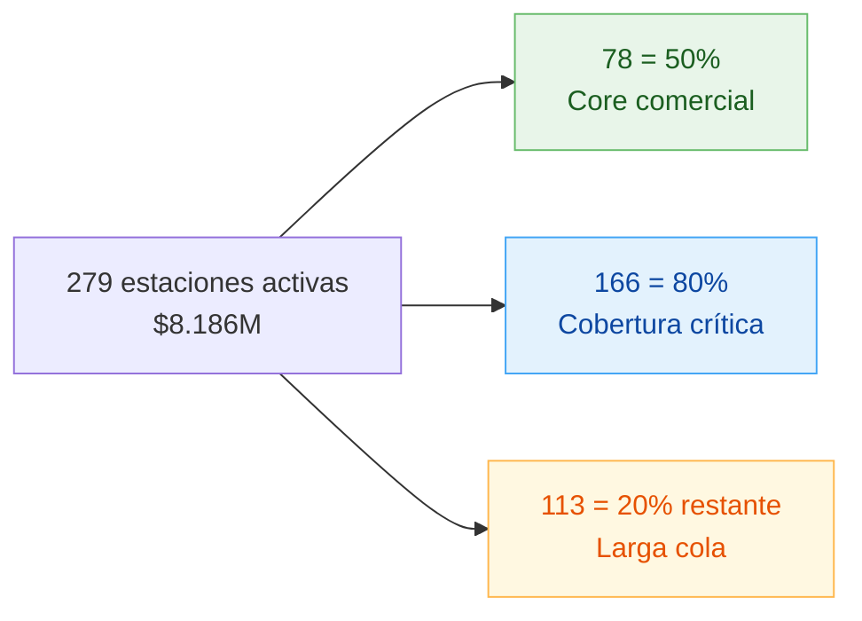

# F4 — Comportamiento por Estación de servicio

> Punto 4 de la prueba. Por tipo + Pareto + top + fidelización + medidas DAX.

## 1. Cobertura

- **Estaciones en maestro:** 407
- **Estaciones activas (con tx en la semana):** 279
- **Estaciones inactivas:** 128 (**31,5% del maestro**)
- **Ventana:** 7 días (24-30 jul 2017)

### 1.1 Inactivas por tipo (señal de calidad del maestro)

| Tipo | Inactivas | Maestro | % inactivo |
|------|----------:|--------:|-----------:|
| Propia GNV       | 55  | 107 | **51,4%** |
| Operadora        | 17  |  45 | 37,8% |
| Franquiciada GNV | 56  | 251 | 22,3% |

> **Más de la mitad de las estaciones "Propias" no facturó en la semana.** Posibles causas: cerradas operativamente, en mantenimiento, registros obsoletos del maestro, o estaciones piloto sin operación real. Requiere validación con operación.

## 2. Comportamiento por TipoEstacion

| Tipo | Valor | %Val | Estaciones activas | Cobertura maestro | Valor/Estación | Ticket prom | %Fidelizados |
|------|------:|-----:|------------------:|------------------:|---------------:|------------:|-------------:|
| **Franquiciada GNV** | $5.765.955.134 | **70,4%** | 195 | 77,7% | $29.569.001 | $11.399 | 80,3% |
| Propia GNV       | $1.510.489.633 | 18,5% |  52 | 48,6% | $29.047.878 | $10.163 | **83,7%** |
| Operadora        |   $798.325.388 |  9,8% |  28 | 62,2% | $28.511.621 | $11.390 | 82,7% |
| Sin Clasificar   |   $111.703.687 |  1,4% |   4 | 100%  | $27.925.922 | $10.422 | 85,8% |

**Lecturas:**
- **Franquiciada GNV es la columna vertebral del negocio** (70% del valor).
- **Valor por estación es prácticamente igual entre tipos** ($28-30M/semana). El modelo de negocio rinde parecido independiente del esquema de operación.
- **Propia tiene mayor fidelización** (+3,4 pp vs Franquiciada). Coherente: la operación directa permite mejor control de la captura del IdCliente.
- **Ticket promedio menor en Propia** ($10.163) sugiere mix de clientes de menor consumo o mayor proporción de motos/vehículos pequeños.

## 3. Pareto de estaciones

| Umbral | Estaciones | % del total activo |
|-------:|-----------:|-------------------:|
|  50% del valor |  78 | 28,0% |
|  80% del valor | **166** | **59,5%** |
|  90% del valor | 208 | 74,6% |
|  95% del valor | 234 | 83,9% |



**Lectura:** el Pareto es **menos agresivo que el regional** (59% de estaciones hacen el 80% vs 37% de departamentos). El valor está más repartido entre puntos de venta — ninguna estación es indispensable por sí sola.

## 4. Top 10 estaciones

| # | Id | Tipo | Dpto | Ciudad | Valor | % | %Fidelizados |
|--:|---:|------|------|--------|------:|--:|-------------:|
|  1 | 1592 | Operadora        | VALLE     | CALI         | $105.776.029 | 1,3% | 90,4% |
|  2 | 1557 | Operadora        | BOGOTA    | BOGOTÁ D.C.  |  $82.518.618 | 1,0% | 76,1% |
|  3 | 2129 | Franquiciada GNV | BOGOTA    | BOGOTÁ D.C.  |  $81.223.198 | 1,0% | 65,7% |
|  4 | 2138 | Franquiciada GNV | BOGOTA    | BOGOTÁ D.C.  |  $76.187.011 | 0,9% | 79,8% |
|  5 | 1125 | Propia GNV       | ATLANTICO | BARRANQUILLA |  $75.382.630 | 0,9% | 77,5% |
|  6 | 1966 | Franquiciada GNV | BOGOTA    | BOGOTÁ D.C.  |  $75.007.721 | 0,9% | 88,4% |
|  7 | 1278 | Franquiciada GNV | QUINDIO   | ARMENIA      |  $74.970.937 | 0,9% | **97,4%** |
|  8 | 1154 | Propia GNV       | VALLE     | CALI         |  $73.448.873 | 0,9% | 86,4% |
|  9 | 1234 | Franquiciada GNV | BOGOTA    | BOGOTÁ D.C.  |  $72.336.836 | 0,9% | 55,9% |
| 10 | 1158 | Propia GNV       | VALLE     | CALI         |  $71.131.011 | 0,9% | 91,9% |

**Lectura:** ninguna estación individual supera el 1,3% del total. Top 10 = **9,3% del valor**. Operación bien distribuida en la cabeza del Pareto.

## 5. Fidelización (captura de IdCliente)

- **Global: 81,3%** de las transacciones tienen IdCliente identificado (137.383 sin identificar = 18,7%).
- **Brecha enorme entre estaciones** (con ≥ 1.000 tx):

### Top 5 mejor fidelización

| Estación | Tipo | Ciudad | %Fid | Tx |
|---------:|------|--------|-----:|---:|
| 1160 | Propia GNV       | Tuluá        | **97,9%** | 1.802 |
| 1278 | Franquiciada GNV | Armenia      | 97,4% | 5.622 |
| 1193 | Franquiciada GNV | Sincelejo    | 96,9% | 4.035 |
| 1257 | Franquiciada GNV | Buga         | 96,7% | 2.573 |
| 1632 | Propia GNV       | Armenia      | 96,6% | 1.752 |

### Bottom 5 peor fidelización

| Estación | Tipo | Ciudad | %Fid | Tx |
|---------:|------|--------|-----:|---:|
| 2032 | Franquiciada GNV | Bucaramanga | **28,7%** | 1.873 |
| 1498 | Franquiciada GNV | Bogotá D.C. | 43,3% | 4.147 |
| 1276 | Franquiciada GNV | Bogotá D.C. | 43,4% | 2.787 |
| 1296 | Franquiciada GNV | Bogotá D.C. | 44,1% | 3.150 |
| 1333 | Franquiciada GNV | Soacha      | 47,0% | 3.081 |

> **Anomalía Bogotá:** 3 de las 5 estaciones con peor fidelización están en Bogotá D.C. (43-44%). Sugiere falla operativa local, falta de promoción del programa, o personal sin entrenamiento. **Validar con operación regional.**

## 6. Hallazgos

1. **Franquiciada concentra el 70% del negocio** — el modelo de franquicia es el principal canal de venta.
2. **51% de las Propias no operaron en la semana** — alerta crítica de calidad del maestro o de operación.
3. **Valor por estación uniforme entre tipos** — no hay ventaja comercial estructural por tipo. Lo que diferencia es ubicación y fidelización.
4. **Pareto distribuido** — 166 estaciones hacen el 80%. Caída individual de cualquier estación no es crítica, pero un cluster regional sí lo sería.
5. **Top 10 generan solo 9,3%** del valor → no hay estaciones "estrella" que justifiquen inversión desproporcionada en una sola.
6. **Brecha de fidelización 28%-97%** entre estaciones del mismo tipo y país → la diferencia es operativa, no estructural.
7. **Bucaramanga 2032: 28,7% fidelización con 1.873 tx** → caso crítico, ~70% de las cargas no se atribuyen al cliente.

## 7. Medidas DAX para Power BI

### 7.1 Métricas base

```dax
Valor Venta := SUM ( Trans[ValorVenta] )

Total Tickets := COUNTROWS ( Trans )

Total Galones := SUM ( Trans[Gal] )

Estaciones Activas := DISTINCTCOUNT ( Trans[IdEstacion] )

Clientes Unicos := DISTINCTCOUNT ( Trans[IdCliente] )

Ticket Promedio := DIVIDE ( [Valor Venta], [Total Tickets] )

Valor por Estacion := DIVIDE ( [Valor Venta], [Estaciones Activas] )
```

### 7.2 % Fidelización

> Si `Trans[cliente_identificado]` es bool (TRUE/FALSE):

```dax
Tx Identificadas :=
CALCULATE ( [Total Tickets], Trans[cliente_identificado] = TRUE )

Pct Fidelizacion :=
DIVIDE ( [Tx Identificadas], [Total Tickets] )
```

### 7.3 Ranking y Pareto estaciones

```dax
Pct Valor Estacion :=
DIVIDE ( [Valor Venta], CALCULATE ( [Valor Venta], ALL ( Estaciones[IdEstacion] ) ) )

Ranking Estacion :=
RANKX ( ALL ( Estaciones[IdEstacion] ), [Valor Venta],, DESC, DENSE )

Pct Acumulado Estacion :=
VAR ValorActual = [Valor Venta]
VAR Tabla =
    ADDCOLUMNS ( ALL ( Estaciones[IdEstacion] ), "Val", [Valor Venta] )
RETURN
    DIVIDE (
        SUMX ( FILTER ( Tabla, [Val] >= ValorActual ), [Val] ),
        SUMX ( Tabla, [Val] )
    )

Es Top Pareto :=
IF ( [Pct Acumulado Estacion] <= 0.80, "Top 80%", "Cola 20%" )
```

### 7.4 Cobertura del maestro (estaciones inactivas)

> Asume tabla `Estaciones` con todas las 407 + relación a `Trans`.

```dax
Estaciones Maestro :=
COUNTROWS ( Estaciones )

Estaciones Inactivas :=
[Estaciones Maestro] - [Estaciones Activas]

Pct Cobertura :=
DIVIDE ( [Estaciones Activas], [Estaciones Maestro] )
```

### 7.5 Comparativo Tipo vs Promedio

```dax
Valor por Estacion Tipo :=
DIVIDE (
    [Valor Venta],
    [Estaciones Activas]
)

Valor por Estacion Global :=
CALCULATE (
    [Valor por Estacion Tipo],
    ALL ( Estaciones[TipoEstacion] )
)

Indice vs Global :=
DIVIDE ( [Valor por Estacion Tipo], [Valor por Estacion Global] )
```

## 8. Limitaciones

- **1 semana de datos** — las "inactivas" pueden ser estaciones en mantenimiento programado o festivos locales. No es evidencia definitiva de cierre.
- **No hay coordenadas geográficas** en `Estaciones` → no se puede analizar densidad espacial (¿hay sobreoferta en Bogotá centro vs sub-cobertura en sur?).
- **No hay metadatos de operación** (horario, surtidores, área) → no se puede normalizar valor por capacidad instalada.

## 9. Recomendaciones

1. **Auditoría inmediata del maestro de Propias** — 55 estaciones inactivas representan 51% del parque propio. Decidir: dar de baja, reactivar, o investigar fallas de captura.
2. **Programa de mejora de fidelización en bottom 5** — particularmente Bogotá (3 estaciones <45%) y Bucaramanga 2032 (28,7%). Diagnóstico operativo + relanzamiento del programa.
3. **Replicar prácticas del top 5 fidelización** — Tuluá 1160 (97,9%) y Armenia 1278 (97,4%) son benchmarks. Identificar qué hacen distinto.
4. **No invertir en "estaciones estrella"** — el Pareto distribuido confirma que el crecimiento viene de mejorar las 166 estaciones del top 80%, no de exprimir el top 10.

## 10. Checklist visualización en Power BI

- [ ] Treemap por `TipoEstacion` × `Valor Venta`
- [ ] Tabla detalle Top 30 estaciones con `Ranking`, `% Acumulado`, `% Fidelización`
- [ ] Gráfico Pareto: barras Valor por estación + línea Pct Acumulado
- [ ] KPI cards: Estaciones Activas / Maestro / Cobertura
- [ ] Scatter: `Valor Venta` (eje X) × `Pct Fidelizacion` (eje Y) → identifica estaciones grandes con baja fidelización (cuadrante crítico)
- [ ] Slicer por `TipoEstacion`, `NombreDpto`, `Es Top Pareto`
