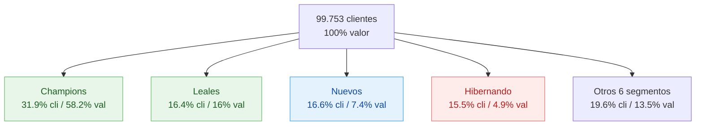

# F5 — Segmentación RFM (Recencia · Frecuencia · Monetario)

> Punto 5 de la prueba. Modelo RFM adaptado a 7 días + caracterización con demografía + medidas DAX.

## 1. Universo

- **Clientes con compras identificadas:** 99.753 (de 801.337 en maestro = 12,4% activos en la semana)
- **Transacciones consideradas:** 597.892 (solo `cliente_identificado = True`)
- **Fecha de referencia:** 2017-07-30
- **Ventana:** 7 días

## 2. Metodología adaptada a 7 días

### 2.1 Recencia (R) — scoring manual

`pd.qcut` con quintiles **NO funciona** sobre Recencia con solo 7 días (max 7 valores únicos posibles). Reemplazado por scoring directo basado en el día:

| Días desde última compra | Score R | Clientes |
|-------------------------:|--------:|---------:|
| 0 (compró hoy)   | 5 | 45.803 |
| 1                | 4 | 23.570 |
| 2                | 3 | 12.548 |
| 3-4              | 2 | 11.617 |
| 5-6              | 1 |  6.215 |

### 2.2 Frecuencia (F) y Monetario (M) — quintiles balanceados

Con 99.753 clientes hay suficiente cardinalidad para quintiles:

| Score | Frecuencia (tx) | Monetario (COP) |
|------:|-----------------|------------------|
| 5 | top 20% (más activos) | top 20% (mayor gasto) |
| 1 | bottom 20% | bottom 20% |

Cada nivel tiene ~19.950 clientes (5 quintiles × 20%).

**Estadísticos de Frecuencia:** mediana 4 tx · p90 = 13 tx · max 42 tx
**Estadísticos de Monetario:** mediana $55.461 · p90 = $135.310 · p99 = $248.624

### 2.3 Reglas de segmentación

```
Champions             : R >= 4 AND F >= 4 AND M >= 4
Leales                : R >= 4 AND F >= 3 AND M >= 3
Nuevos                : R >= 4 AND F <= 2
Frecuentes bajo valor : R >= 3 AND F >= 3 AND M <= 2
No puedo perderlos    : R <= 2 AND F >= 4 AND M >= 4
En riesgo             : R <= 2 AND F >= 3
Grandes durmiendo     : R <= 2 AND F <= 2 AND M >= 4
Hibernando            : R <= 2 AND F <= 2
Potencial leal        : RFM_Score >= 9 (resto)
Necesitan atencion    : (sin match)
```

## 3. Resultados por segmento

| Segmento | Clientes | %Cli | %Valor | Valor prom | F prom | R prom (días) | Edad prom | %Flotas |
|----------|---------:|-----:|-------:|-----------:|-------:|--------------:|----------:|--------:|
| **Champions** | 31.916 | **31,9%** | **58,2%** | $124.176 | 11,8 | 0,2 | 47 | 12,0% |
| Leales | 16.425 | 16,4% | 16,0% | $66.425 | 5,7 | 0,4 | 48 | 3,9% |
| Nuevos | 16.620 | 16,6% | 7,4% | $30.453 | 2,0 | 0,5 | 48 | 0,0% |
| Potencial leal | 4.352 | 4,4% | 5,3% | $83.613 | 5,6 | 2,0 | 46 | 7,0% |
| Hibernando | 15.467 | 15,5% | 4,9% | $21.771 | 1,4 | 4,2 | 48 | 0,0% |
| Necesitan atención | 7.169 | 7,2% | 3,0% | $28.021 | 1,8 | 2,0 | 48 | 0,0% |
| Frecuentes bajo valor | 5.606 | 5,6% | 2,9% | $34.678 | 4,3 | 0,7 | 47 | 2,4% |
| En riesgo | 1.847 | 1,8% | 1,5% | $53.666 | 4,4 | 3,4 | 46 | 5,6% |
| Grandes durmiendo | 302 | 0,3% | 0,4% | $90.513 | 2,4 | 3,5 | 48 | 0,0% |
| No puedo perderlos | 226 | 0,2% | 0,4% | $107.519 | 8,5 | 3,1 | 44 | **27,9%** |

## 4. Mapa de segmentos



## 5. Caracterización transversal

### 5.1 Edad: no discrimina segmentos

| Segmento | Edad promedio |
|----------|--------------:|
| Champions | 47 |
| Leales | 48 |
| Nuevos | 48 |
| Hibernando | 48 |
| No puedo perderlos | 44 |

> **Toda la base opera en una franja etaria estrecha (44-48 años promedio).** La edad NO es palanca de segmentación. El mensaje comercial puede ser uniforme demográficamente.
>
> Limitación: el 40,2% de clientes tiene `FechaNac_confiable = False`. El promedio se calcula solo sobre el 59,8% válido.

### 5.2 Segmento original (SUSTENTO/RECORRIDO/NEGOCIO/Sin Segmento): NO discrimina

| Segmento RFM | SUSTENTO | RECORRIDO | Sin Segmento |
|--------------|---------:|----------:|-------------:|
| Champions | 94,0% | 5,0% | 1,0% |
| Leales | 90,9% | 7,4% | 1,7% |
| Hibernando | 86,8% | 10,8% | 2,4% |
| No puedo perderlos | 92,2% | 7,3% | 0,5% |
| (todos los segmentos) | ~87-94% | ~5-11% | ~0,5-2,6% |

> **SUSTENTO domina en TODOS los segmentos (87-94%).** El segmento original de la marca **no explica el comportamiento RFM**. RFM es el discriminador real, no la categoría declarada.
>
> Categoría `NEGOCIO` desaparece (<0,5% en todos). Es una clasificación residual sin operación significativa.

### 5.3 Geografía: coherente con la distribución regional

Los 3 departamentos top (Valle, Bogotá, Atlántico) son top en TODOS los segmentos RFM. La segmentación no introduce un sesgo geográfico — refleja el peso del negocio en cada territorio.

| Segmento RFM | Top 1 dpto | Top 2 dpto | Top 3 dpto |
|--------------|------------|------------|------------|
| Champions | Valle (8.418) | Bogotá (5.584) | Atlántico (5.310) |
| Leales | Valle (3.944) | Bogotá (3.884) | Atlántico (1.647) |
| Nuevos | Valle (3.853) | Bogotá (3.828) | Antioquia (1.834) |
| Hibernando | Bogotá (4.136) | Valle (3.187) | Antioquia (1.971) |

### 5.4 Flotas: solo distinguen los segmentos premium

| Segmento | %Flotas (≥ 4 placas) |
|----------|---------------------:|
| **No puedo perderlos** | **27,9%** |
| Champions | 12,0% |
| Potencial leal | 7,0% |
| En riesgo | 5,6% |
| Leales | 3,9% |
| Frecuentes bajo valor | 2,4% |
| Resto | 0,0% |

> **Las flotas se concentran en los segmentos de mayor frecuencia y valor.** Especialmente "No puedo perderlos" (28%) — un cluster pequeño (226 clientes) pero crítico: alta frecuencia + alto valor + alta probabilidad de ser empresa, recientemente alejado.

## 6. Hallazgos clave

1. **Champions absorben el 58,2% del valor con 31,9% de los clientes** — pirámide invertida muy concentrada.
2. **El segmento original de la marca es ruido** — SUSTENTO está en todos lados. RFM aporta la primera segmentación verdaderamente útil.
3. **Edad no segmenta** — base etariamente uniforme (44-48). No hay "perfil joven" ni "perfil senior" diferenciado.
4. **Hibernando es grande pero poco valioso** — 15.467 clientes con $21.771 promedio. Costo de reactivación debe ser bajo o no compensa.
5. **"No puedo perderlos" es el cluster premium oculto** — 226 clientes, 28% son flotas, $107.519 promedio. Cada uno vale ~5× el cliente promedio.
6. **"Nuevos" es la mayor oportunidad de crecimiento** — 16.620 clientes recién captados (R≥4, F≤2). Si la mitad se vuelven Leales, el valor crece significativamente.
7. **Geografía neutra al modelo** — RFM no requiere ajuste regional, la estructura es la misma en todas las regiones top.

## 7. Estrategias por segmento

| Segmento | Acción primaria | Métrica de éxito |
|----------|-----------------|------------------|
| **Champions** | Mantener: programa VIP, atención preferencial, beneficios incrementales | Retención mensual ≥ 95% |
| **Leales** | Subir a Champions: incentivar 1-2 cargas más por semana | Promoción al segmento superior |
| **Nuevos** | Onboarding y 2da compra: ofertas en próximos 7-14 días | Tasa de 2da compra |
| **Potencial leal** | Activación: mensaje de retorno + beneficio | Recencia → 0-1 día |
| **No puedo perderlos** | Recuperación urgente: contacto comercial 1-a-1, descuento, soporte | Recencia → 0-1 día |
| **En riesgo** | Win-back: campaña masiva, recordatorio | Recencia → 0-2 días |
| **Frecuentes bajo valor** | Upsell: aumentar ticket (combo, premium) | Monetario → +20% |
| **Grandes durmiendo** | Investigación: ¿por qué se fueron? Encuesta | Diagnóstico cualitativo |
| **Hibernando** | Bajo costo: campaña automatizada de bajo gasto | Costo/contacto mínimo |
| **Necesitan atención** | Triage: dejar pasar o segmentar más fino | — |

## 8. Medidas DAX para Power BI

> Asume tabla `Trans` con `IdCliente`, `FechaVenta`, `ValorVenta`, `Gal`, `Placa`, `cliente_identificado`. Tabla `Calendario` con la fecha máxima como referencia.

### 8.1 Métricas RFM por cliente

```dax
Fecha Referencia := MAX ( Trans[FechaVenta] )

Recencia Cliente :=
DATEDIFF (
    CALCULATE ( MAX ( Trans[FechaVenta] ), Trans[cliente_identificado] = TRUE ),
    [Fecha Referencia],
    DAY
)

Frecuencia Cliente :=
CALCULATE ( COUNTROWS ( Trans ), Trans[cliente_identificado] = TRUE )

Monetario Cliente :=
CALCULATE ( SUM ( Trans[ValorVenta] ), Trans[cliente_identificado] = TRUE )

Num Placas Cliente :=
CALCULATE ( DISTINCTCOUNT ( Trans[Placa] ), Trans[cliente_identificado] = TRUE )
```

### 8.2 Scoring R, F, M

> **R con scoring manual** (solo 7 días):

```dax
R Score :=
SWITCH (
    TRUE (),
    [Recencia Cliente] = 0, 5,
    [Recencia Cliente] = 1, 4,
    [Recencia Cliente] = 2, 3,
    [Recencia Cliente] <= 4, 2,
    1
)
```

> **F y M con quintiles** (requiere columna calculada o tabla resumen):

```dax
-- Columna calculada en tabla CLIENTES (precalculada)
F Score =
VAR Total = COUNTROWS ( Clientes )
VAR Rank = RANKX ( ALL ( Clientes ), Clientes[Frecuencia],, ASC, DENSE )
RETURN
    SWITCH (
        TRUE (),
        Rank <= Total * 0.2, 1,
        Rank <= Total * 0.4, 2,
        Rank <= Total * 0.6, 3,
        Rank <= Total * 0.8, 4,
        5
    )

-- Igual para M Score usando Clientes[Monetario]
```

### 8.3 Segmento RFM

```dax
Segmento RFM =
VAR R = Clientes[R Score]
VAR F = Clientes[F Score]
VAR M = Clientes[M Score]
RETURN
    SWITCH (
        TRUE (),
        R >= 4 && F >= 4 && M >= 4, "Champions",
        R >= 4 && F >= 3 && M >= 3, "Leales",
        R >= 4 && F <= 2,           "Nuevos",
        R >= 3 && F >= 3 && M <= 2, "Frecuentes bajo valor",
        R <= 2 && F >= 4 && M >= 4, "No puedo perderlos",
        R <= 2 && F >= 3,           "En riesgo",
        R <= 2 && F <= 2 && M >= 4, "Grandes durmiendo",
        R <= 2 && F <= 2,           "Hibernando",
        R + F + M >= 9,             "Potencial leal",
        "Necesitan atencion"
    )
```

### 8.4 Flag EsFlota

```dax
EsFlota = IF ( Clientes[Num Placas Cliente] >= 4, "Flota", "Particular" )
```

### 8.5 Métricas a nivel segmento

```dax
Clientes Segmento := DISTINCTCOUNT ( Clientes[IdCliente] )

Valor Segmento := SUM ( Clientes[Monetario] )

Pct Clientes Segmento :=
DIVIDE ( [Clientes Segmento], CALCULATE ( [Clientes Segmento], ALL ( Clientes[Segmento RFM] ) ) )

Pct Valor Segmento :=
DIVIDE ( [Valor Segmento], CALCULATE ( [Valor Segmento], ALL ( Clientes[Segmento RFM] ) ) )

Valor Promedio Cliente := DIVIDE ( [Valor Segmento], [Clientes Segmento] )
```

## 9. Limitaciones

1. **Recencia muy comprimida (0-6 días)** — el scoring R es razonable pero pierde finura. Con más historia, se podría usar quintiles reales (0-7, 8-30, 31-60, 61-90, 90+).
2. **Solo 12,4% de la base con actividad en la semana** — el RFM se calcula sobre 99.753 clientes, no sobre los 801.337 del maestro. Los 700k+ inactivos no entran al modelo.
3. **18,7% de transacciones sin IdCliente** — esas tx generan $8M+ que no se atribuyen al RFM y subestiman a los clientes que sí cargan pero a veces sin identificarse.
4. **40,2% de FechaNac no confiable** — el promedio de edad por segmento se calcula solo sobre data válida. No representativo si hay sesgo sistemático.
5. **F y M dependen de quintiles sobre la muestra** — al cambiar la semana de análisis, los cortes de quintil cambian. Para PBI: precomputar o usar bins absolutos definidos por negocio.

## 10. Checklist visualización en Power BI

- [ ] Tabla columna `Segmento RFM` agregando `Clientes`, `Pct Clientes`, `Valor`, `Pct Valor`, `Valor Promedio Cliente`
- [ ] Treemap por `Segmento RFM` × `Valor`
- [ ] Matriz R × F (5×5) con color por valor total → identifica celdas premium
- [ ] Slicer cruzado por `EsFlota`, `NombreDpto`, `Segmento` (original)
- [ ] KPI cards: Champions / No puedo perderlos / Hibernando (los 3 críticos)
- [ ] Scatter: F (eje X) × M (eje Y) tamaño por clientes, color por segmento RFM
