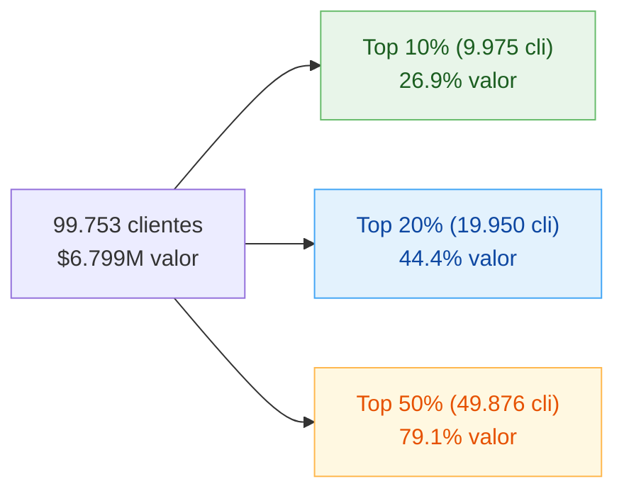

# F6 — Clientes de mayor valor para la marca

> Punto 6 de la prueba. Identificación de top clientes + concentración + perfil + medidas DAX.

## 1. Universo

- **Clientes identificados con compras:** 99.753
- **Valor venta atribuido:** $6.798.506.250 COP
- **Transacciones identificadas:** 597.892
- **Valor no atribuible (sin IdCliente):** $1.387.967.592 (**17,0% del total operativo**)

## 2. Concentración de valor (Top N%)

| Tramo | Clientes | Valor sumado | % del valor |
|------:|---------:|-------------:|------------:|
| **Top 1%**  |    997 |   $327.682.324 |  **4,8%** |
| **Top 5%**  |  4.987 | $1.090.758.843 | 16,0% |
| **Top 10%** |  9.975 | $1.825.851.557 | **26,9%** |
| **Top 20%** | 19.950 | $3.019.444.701 | **44,4%** |
| Top 30% | 29.925 | $3.977.117.520 | 58,5% |
| Top 50% | 49.876 | $5.375.655.850 | **79,1%** |



## 3. Pareto inverso (cuántos clientes para X% del valor)

| Para alcanzar | Clientes | % base |
|---------------|---------:|-------:|
| 50% del valor | 23.660 | 23,7% |
| **80% del valor** | **51.030** | **51,2%** |
| 90% del valor | 66.293 | 66,5% |

**Lectura clave:** el negocio NO sigue la regla clásica 80/20. Se acerca a una **regla 80/50** — se necesita medio universo de clientes para concentrar el 80% del valor. La base es **menos concentrada de lo esperado**, lo cual es positivo (menor riesgo de dependencia de pocos clientes) pero también indica que **no hay un grupo pequeño dominante para hipersegmentar**.

## 4. Top 10 clientes individuales

| # | IdCliente | Valor (semana) | Frec | Placas | Estaciones | Dpto | Segmento orig |
|--:|----------:|---------------:|-----:|-------:|-----------:|------|---------------|
|  1 | 1882443 | **$1.165.839** |  6 |  1 |  1 | VALLE   | SUSTENTO |
|  2 | 1808690 |   $830.278 | 14 |  2 |  1 | BOYACA  | RECORRIDO |
|  3 |  566196 |   $797.287 | 10 |  1 |  1 | VALLE   | Sin Segmento |
|  4 | 1945044 |   $791.445 | 12 |  2 |  3 | CAUCA   | SUSTENTO |
|  5 |  717685 |   $747.544 | 12 |  1 |  1 | BOLIVAR | SUSTENTO |
|  6 |  584727 |   $745.383 | 14 |  2 |  1 | BOLIVAR | SUSTENTO |
|  7 | 1939996 |   $735.771 | 22 | 18 |  1 | BOGOTA  | SUSTENTO |
|  8 |  782009 |   $701.914 | 31 | 12 |  1 | VALLE   | RECORRIDO |
|  9 |  748105 |   $697.615 | 26 |  2 |  1 | VALLE   | SUSTENTO |
| 10 | 1897398 |   $687.363 | 31 |  1 |  1 | VALLE   | SUSTENTO |

> **Anomalía Cliente #1 (1882443):** $1,17M en solo 6 transacciones, 1 placa, 1 estación. Promedio de carga: ~$194k por tx. **A validar:** ¿vehículo de carga pesada legítimo? ¿carga industrial? ¿error de captura?
>
> Patrón mixto en el top 10: algunos compran mucho en pocas cargas grandes (#1, #3) y otros con muchas cargas medianas (#8, #10 con 31 tx).

## 5. Perfil del Top 10% (clientes premium)

| Atributo | Valor |
|----------|------:|
| Clientes | 9.975 |
| Valor sumado | $1.825.910.426 |
| Valor promedio | $183.049 |
| Frecuencia promedio | 14,5 tx |
| Ticket promedio | $15.273 |
| **% Flotas (≥4 placas)** | **26,7%** |
| Edad promedio | 45,9 |
| Segmento original | SUSTENTO 93% · RECORRIDO 6% · Sin Segmento 1% |
| Top 5 dptos | Valle (24%) · Bogotá (16%) · Atlántico (13%) · Bolívar (6%) · Antioquia (5%) |

## 6. Perfil del Top 1% (super premium)

| Atributo | Valor |
|----------|------:|
| Clientes | 997 |
| Valor sumado | $327.682.324 (**4,8%** del valor total) |
| Valor promedio | $328.668 |
| Frecuencia promedio | 15,9 tx |
| Placas promedio | **8,6** |
| **% Flotas** | **63,3%** |
| Top 5 dptos | Valle (30%) · Bogotá (23%) · Bolívar (9%) · Risaralda (5%) · Cundinamarca (4%) |

> **El Top 1% es predominantemente flotas/empresas.** 6 de cada 10 tienen 4+ placas, con promedio de **8,6 placas por cliente**. Tratar este cluster como cuenta corporativa, no como cliente individual.

## 7. Brecha de cobertura — ventas no atribuidas

| Concepto | Valor |
|----------|------:|
| Tx sin IdCliente | 137.381 (18,7%) |
| Valor no atribuible | **$1.387.967.592** |
| % del total operativo | **17,0%** |

> **Recuperar la mitad de la atribución** equivale a +8,5% del valor visible. **Es la palanca individual más grande de mejora** del negocio — supera el valor combinado de los 997 clientes del Top 1%.

## 8. Hallazgos clave

1. **Distribución 80/50, no 80/20.** El negocio es más democrático de lo esperado — 51% de los clientes hace el 80% del valor. Beneficio: bajo riesgo de pérdida de un cliente individual. Costo: difícil hipersegmentar pocos.
2. **Top 10% (~26,9% valor) es el bloque manejable** para programa de fidelización premium. Tamaño operativo razonable (~10k clientes).
3. **Top 1% son flotas** (63%). Estrategia: cuenta corporativa, ejecutivo dedicado, contrato volumen.
4. **Top 10 incluye outliers para verificar** — cliente #1 con $1,17M / 6 tx / 1 placa requiere auditoría.
5. **17% de los ingresos NO se atribuyen** a ningún cliente. Es la mayor oportunidad individual: cada punto recuperado equivale a ~$80M COP/semana.
6. **Segmento original SUSTENTO domina incluso en el top** (93%) → el segmento no discrimina valor. El verdadero valor está en RFM, no en la categoría declarada.
7. **Geografía top mantiene el patrón nacional**: Valle, Bogotá, Atlántico siguen liderando — no hay un "nicho premium geográfico" distinto al peso general del negocio.

## 9. Medidas DAX para Power BI

> Asume tabla `Clientes` con `IdCliente`, `Valor`, `Frec`, `Placas`, columna calculada `EsFlota`. Tabla `Trans` con `IdCliente`, `ValorVenta`, `cliente_identificado`.

### 9.1 Ranking y percentiles

```dax
Valor Cliente := SUM ( Trans[ValorVenta] )

Ranking Cliente :=
RANKX ( ALL ( Clientes[IdCliente] ), [Valor Cliente],, DESC, DENSE )

Pct Cliente Acumulado :=
DIVIDE (
    [Ranking Cliente],
    CALCULATE ( DISTINCTCOUNT ( Clientes[IdCliente] ), ALL ( Clientes ) )
)
```

### 9.2 Concentración Top N

```dax
Es Top 1 Pct  := IF ( [Pct Cliente Acumulado] <= 0.01, "Top 1%",
                IF ( [Pct Cliente Acumulado] <= 0.10, "Top 10%",
                IF ( [Pct Cliente Acumulado] <= 0.20, "Top 20%",
                                                       "Resto" ) ) )
```

Usar como leyenda en gráficos para separar visualmente el peso del top.

### 9.3 Pareto acumulado por valor

```dax
Pct Valor Acumulado Cliente :=
VAR ValorActual = [Valor Cliente]
VAR Tabla =
    ADDCOLUMNS ( ALL ( Clientes[IdCliente] ), "Val", [Valor Cliente] )
RETURN
    DIVIDE (
        SUMX ( FILTER ( Tabla, [Val] >= ValorActual ), [Val] ),
        SUMX ( Tabla, [Val] )
    )
```

### 9.4 Métricas comparativas top vs resto

```dax
Valor Promedio Cliente :=
DIVIDE ( [Valor Cliente], DISTINCTCOUNT ( Clientes[IdCliente] ) )

Frecuencia Promedio :=
AVERAGEX ( VALUES ( Clientes[IdCliente] ), [Total Tickets] )

Pct Flotas en Tramo :=
DIVIDE (
    CALCULATE ( DISTINCTCOUNT ( Clientes[IdCliente] ), Clientes[EsFlota] = "Flota" ),
    DISTINCTCOUNT ( Clientes[IdCliente] )
)
```

### 9.5 Ventas no atribuibles (KPI ejecutivo)

```dax
Valor No Atribuible :=
CALCULATE ( SUM ( Trans[ValorVenta] ), Trans[cliente_identificado] = FALSE )

Pct No Atribuible :=
DIVIDE ( [Valor No Atribuible], SUM ( Trans[ValorVenta] ) )

Oportunidad Captura 50pct :=
[Valor No Atribuible] * 0.5
```

## 10. Limitaciones

1. **1 semana de datos** — el cliente #1 puede ser un caso atípico de la semana, no su perfil real (vacaciones, viaje único). Para identificar Top "estable" se necesitan 4+ semanas.
2. **17% de tx no atribuidas** distorsionan a la baja el valor real de cada cliente identificado. Un Top 10% real podría incluir clientes hoy invisibles.
3. **2.055 clientes en tx sin ficha en Customers** → no se pueden caracterizar demográficamente (edad, segmento, ciudad). Aparecen como NaN en cruces.
4. **No hay metadato comercial** (tipo de vehículo, sector de cliente) → la inferencia "flota = empresa" se hace solo por número de placas.

## 11. Estrategias por tramo

| Tramo | Tamaño | Acción primaria | Tipo de programa |
|-------|-------:|-----------------|------------------|
| **Top 1%** | 997 | Cuenta corporativa, ejecutivo asignado, contrato volumen | KAM (Key Account Management) |
| **Top 2-10%** | ~9.000 | Programa fidelización premium, beneficios escalonados, comunicación 1-a-1 | CRM / loyalty premium |
| **Top 11-50%** | ~40.000 | Programa fidelización masivo (puntos, descuentos, app móvil) | CRM masivo |
| **Cola 51-100%** | ~50.000 | Mantener servicio, evitar churn, comunicación automatizada | Bajo costo |
| **Sin atribución** | 137.381 tx | Programa de captura agresivo (token, app, QR, SMS) | Recuperación atribución |

## 12. Checklist visualización en Power BI

- [ ] Tabla Top 50/100 clientes con `Ranking`, `Valor`, `Frec`, `Placas`, `Dpto`, `Segmento RFM`
- [ ] Gráfico Pareto: barras `Valor Cliente` ordenado descendente + línea `Pct Valor Acumulado Cliente`
- [ ] Treemap por `Es Top 1 Pct` × `Valor Cliente`
- [ ] KPI cards: `Top 1% Valor`, `Top 10% Valor`, `Valor No Atribuible`, `Pct No Atribuible`
- [ ] Scatter: `Placas` (X) × `Valor Cliente` (Y), color por `Es Top 1 Pct` → visualiza el cluster flotas premium
- [ ] Slicer cruzado: `Segmento RFM`, `EsFlota`, `NombreDpto`
